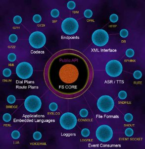
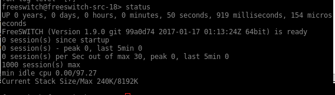

# Архитектура FreeSWITCH

Добро пожаловать в FreeSWITCH! Если Вы читаете это, то вас интересуют такие вещи, как связь в реальном времени, WebRTC, Телекоммуникации и **голос через Интернет-протокол**

(**VoIP**). FreeSWITCH-это полный сервер приложений и гибкий набор инструментов, используемый во всем мире для создания передовых и перспективных коммуникационных приложений. Прежде чем смотреть

в архитектуре этого мощного программного обеспечения давайте взглянем на мир телекоммуникаций. Это поможет поставить FreeSWITCH в перспективе.

В этой главе мы рассмотрим следующие вопросы:

> a двойной оборот связи
>
> Преимущества FreeSWITCH
>
> Конечная точка и Dialplan модули
>
> Как FreeSWITCH упрощает сложные приложения, такие как Voicemail и видеоконференции

## Общение в реальном времени без загадок

**Связь в реальном времени** (**RTC**) началась с телефона во второй половине 1800-х годов и почти сразу превратилась в большую, всемирную, взаимосвязанную сеть крупных компаний и инфраструктуры.

Еще несколько лет назад Телефония была крепостной стеной, строго охраняемой огромными корпорациями, и почти никто не мог полностью понять, как она на самом деле работает. Вы получили шанс получить эти эзотерические знания, посещая внутренние технические семинары и внутренние школы, и даже эти знания были ограничены частью системы, с которой вы должны были работать (центральный офис, последняя миля, АТС и т. д.). Как инфраструктура, несущая и направляющая вызовы, так и приложения, отвечающие на них и управляющие ими, были специальными, жесткими, не совместимыми друг с другом и требовали огромных инвестиций.

Затем две революции полностью уничтожили этот старый мир. Первым из них была революция VoIP-телефонии, которая привела к власти открытый протокол (SIP), сначала в области приложений/АТС, а затем и в инфраструктуре. Во-первых, это была стальная коробка, содержащая проприетарную АТС, которая могла быть расширена только путем изменения внутренних аппаратных карт, сделанных той же компанией, обслуживающих только свой собственный вид и модель аппаратных телефонов. Он был заменен стандартным сервером со стандартной архитектурой ПК, используя стандартные карты расширения, способные поддерживать любые типы телефонов, совместимых со стандартом. Затем SIP поднялся снизу вверх, до самого ядра большой инфраструктуры Telcos. Сегодня все телекоммуникационные инфраструктуры, включая крупные телекоммуникационные компании и операторов связи, работают под управлением некоторой версии протокола SIP.

И вторая революция, которая продолжается прямо сейчас и займет еще несколько лет, чтобы завершить и принести плоды: **WebRTC**. Это очень вводящее в заблуждение название; WebRTC вообще не требует веб-страниц и браузеров. WebRTC-это набор стандартов для зашифрованных соединений конечных точек связи. Этот стандарт WebRTC случился сперва быть снабженным внутри browsers.In тем временем он стал основным способом общения в **Интернете вещей**, охватывая все-от приложений для смартфонов до автомобилей, лифтов, кассиров магазинов и торговых точек.

В настоящее время можно построить системы связи, которые превосходят традиционные голосовые, видео-и конференц-услуги и предлагают расширенные функции за относительно низкую стоимость. FreeSWITCH был разработан, чтобы сделать все это проще, и мы рассмотрим его архитектуру, чтобы получить лучшее понимание того, как он работает.

Не беспокойтесь, если вы не схватите все это одним махом. Обучение требует времени, особенно RTC и VoIP. На самом деле мы рекомендуем Вам прочитать эту главу несколько раз. Впитайте как можно больше на первом проходе, а затем вернитесь после завершения Главы 6, *XML Dialplan*. Вы будете удивлены, насколько улучшилось ваше понимание FreeSWITCH. Затем вернитесь и просмотрите его в третий раз после того , как закончите Главу 10*, диалплан, каталог и все это с помощью XML\_CURL и скриптов*; на этом этапе у вас будет твердое понимание концепций FreeSWITCH. Дайте себе время переварить все эти новые концепции, и вскоре вы обнаружите, что являетесь опытным администратором FreeSWITCH.

Сегодня мы живем в экосистеме из нескольких **РТК** технологий, все сосуществует одновременно: телефонии (например, телефонных коммутаторов и АТС), традиционный аналоговый телефон (**горшки** линий или **обычная телефонная сеть**), сетей традиционной телефонии, выполняемых перевозчиками общего пользования (PSTN или ТфОП), мобильных телефонов (CDMA, GSM и LTE, и т. д.), факсы, коммуникации в реальном времени, приложения для смартфонов, телефонов VoIP и корпоративных систем.

Ниша FreeSWITCH находится прямо в центре этой экосистемы: она соединяет и принимает соединения от всех этих технологий, она соединяет и смешивает их вместе, она предоставляет интерактивные приложения и услуги пользователям независимо от того, где находится их конечная точка. FreeSWITCH способен подключаться к внешним службам передачи данных и устаревшим внутренним системам, компьютерным программам и бизнес-процедурам. FreeSWITCH работает на Linux, Windows и Mac OS X, а также на \*BSD и Solaris. У нас есть множество вариантов оборудования, от больших многопроцессорных серверов до Raspberry Pi. Таким образом, вы можете разрабатывать их на своем ноутбуке, а затем развертывать в центре обработки данных или на встроенном устройстве. Установка FreeSWITCH подробно рассматривается в главе 2\"*Строительство и монтаж*\".

## Конструкция FreeSWITCH-модульная, масштабируемая и стабильная

Цель конструкции FreeSWITCH обеспечить модульную, масштабируемую систему вокруг стабилизированного сердечника переключения, и обеспечить робастный интерфейс для разработчиков для того чтобы добавить к и проконтролировать систему. Различные элементы в FreeSWITCH независимы друг от друга и не имеют много знаний о том, как работают другие части, кроме того, что предусмотрено в том, что называется \"FreeSWITCH API\". Функциональность FreeSWITCH можно расширить с loadable модулями, которые связывают определенную функциональность или внешнюю технологию в сердечник.

FreeSWITCH имеет много различных типов модулей, которые окружают центральное ядро, например датчики и интерфейсы, соединяющие *мозг робота* с внешней средой. Этот список включает в себя следующее:

--------------------------------------------------------------- ----------------------------------------------------------------------------------------------------------------------------------------------------------------
  **Тип модуля**                                                  **Назначение**
  **конечных**                                                    телефонных протоколов типа модуля, таких как линии SIP и PSTN.
  **Приложение**                                                  выполняет такие задачи, как воспроизведение аудио или отправка данных.
  **Автоматизированное распознавание речи** **(** **АСР** **)**   взаимодействует с системами распознавания речи.
  **Чат**                                                         мосты и обмены различными протоколами чата.
  **Кодек**                                                       переводится между аудиоформатами.
  **Dialplan**                                                    анализирует сведения о вызове и решает, куда направить вызов.
  **Каталог**                                                     соединяет информационные службы каталогов, такие как LDAP, с общим базовым API поиска.
  **Обработчики событий**                                         позволяют внешним программам управлять FreeSWITCH.
  **Файл**                                                        предоставляет интерфейс для извлечения и воспроизведения звука из различных форматов аудиофайлов.
  **Форматы**                                                     воспроизводит аудиофайлы в различных форматах.
  **Языки**                                                       программирования язык интерфейсов, используемых для управления вызовами.
  **Loggers**                                                     управляет ведением журнала в консоль, системный журнал или файлы журналов.
  **Say**                                                         связывает вместе аудиофайлы на разных языках, чтобы обеспечить обратную связь с такими вещами, как телефонные номера, время суток, написание слов и так далее.
  **Text-to-Speech** (**TTS**)                                    взаимодействует с механизмами преобразования текста в речь.
  **Таймеры**                                                     POSIX или Linux Kernel timing в приложениях.
  **XML-интерфейсы**                                              используют XML для **подробных записей вызовов** (**CDRs**), CURL, LDAP, RPC и так далее.
--------------------------------------------------------------- ----------------------------------------------------------------------------------------------------------------------------------------------------------------

На следующей диаграмме показано, как выглядит архитектура FreeSWITCH и как модули вращаются вокруг ядра FreeSWITCH:

> 

Объединяя функциональные возможности различных интерфейсов модулей, FreeSWITCH можно настроить для подключения IP-телефонов, линий POTS, WebRTC и IP-телефонных служб. Он также может переводить аудиоформаты и обеспечивает **интерактивную систему голосового ответа** (**IVR**) с пользовательскими меню. Сервер FreeSWITCH также может управляться с другой машины. Давайте начнем с более пристального рассмотрения пары важных типов модулей.

## Важные модули-конечная точка и диалплан

Модули конечных точек критически важны и добавляют некоторые из ключевых функций, которые делают FreeSWITCH мощной платформой. Основная роль модулей конечных точек состоит в том, чтобы взять некоторые общие коммуникационные технологии и нормализовать их в общую абстрактную сущность, которую мы называем **сеансом**. Сеанс представляет собой соединение между

FreeSWITCH и определенный протокол. Существует несколько модулей конечных точек, которые поставляются с

FreeSWITCH, которые реализуют несколько протоколов, таких как SIP, H. 323, Jingle, Verto, WebRTC и некоторые другие. Мы потратим некоторое время на изучение одного из наиболее популярных модулей под названием mod\_sofia.

**София-глоток** ([http://sofia-sip.sourceforge.net](http://sofia-sip.sourceforge.net/)) - это проект с открытым исходным кодом, первоначально разработанный Nokia, который предоставляет программный интерфейс для протокола инициации сеанса (SIP). Разработчики FreeSWITCH много работали над развитием и исправлением своей оригинальной кодовой базы, еще больше повышая ее надежность и возможности. Мы используем нашу версию этой библиотеки в FreeSWITCH (/usr/src/freeswitch/libs/sofia-sip) в модуле с именем mod\_sofia. Этот модуль регистрирует все крючки в FreeSWITCH, необходимые для создания модуля конечной точки, и переводит собственные конструкции FreeSWITCH в Софийские SIP-конструкции и наоборот. Информация о конфигурации берется из конфигурационных файлов FreeSWITCH, что позволяет mod\_sofia загружать пользовательские настройки и сведения о соединении. Это позволяет

FreeSWITCH принимает регистрации от SIP-телефонов и устройств, регистрируется на других SIP-серверах, таких как поставщики услуг, отправляет уведомления и предоставляет услуги телефонам, таким как мигающие огни и голосовая почта.

Когда SIP аудио / видеозвонок устанавливается между FreeSWITCH и другим устройством SIP, он будет отображаться в FreeSWITCH как активный сеанс. Если вызов является входящим, он может быть передан или соединен с меню IVR, удержанием музыки (и/или видео) или с одним или несколькими расширениями. Или он может быть соединен с недавно созданным исходящим вызовом, например, с абонентом ТСОП или браузером WebRTC. Давайте рассмотрим типичный сценарий, когда внутренний SIP-телефон, зарегистрированный как extension 2000, набирает extension 2001 в надежде установить вызов.

Во-первых, SIP-телефон отправляет сообщение настройки вызова FreeSWITCH по сети (mod\_sofia прослушивает такие сообщения). После получения сообщения mod\_sofia, mod\_sofiaв свою очередь, анализирует соответствующие детали, строит абстрактную *session*структуру данных сеанса вызова, понятную ядру, и передает этот вызов в машину состояния ядра в FreeSWITCH. Затем машина состояний (в ядре FreeSWITCH) переводит вызов в состояние **маршрутизации** (то есть ищет пункт назначения).

Следующий шаг Core-найти модуль Dialplan на основе данных конфигурации вызывающей конечной точки. По умолчанию и наиболее широко используемым модулем Dialplan является модуль XML Dialplan. Этот модуль предназначен для поиска списка инструкций из XML-дерева в памяти FreeSWITCH. Модуль XML Dialplan будет анализировать ряд XML-объектов с помощью сопоставления шаблонов регулярных выражений.

Когда мы пытаемся вызвать 2001, мы ищем расширение XML, где destination\_numberполе destination\_number соответствует 2001. Кроме того, давайте помнить, что диалплан не ограничивается сопоставлением только одного расширения. Входящий вызов может соответствовать нескольким добавочным номерам в диалплане, и в главе 6, *XML Dialplan*, вы получите расширенное определение термина extension. Модуль XML Dialplan создает список задач для вызова. Каждое сопоставленное расширение будет иметь свои действия, добавленные в список задач вызова.

Предполагая, что FreeSWITCH находит по крайней мере одно расширение с соответствующим условием, XML-диалплан вставит инструкции в объект сеанса с информацией, необходимой для попытки подключения вызова к 2001 (список задач для этого вызова). Как только эти инструкции установлены, состояние сеанса вызова изменяется от **маршрутизации** к **выполнению**, где ядро детализирует список и выполняет инструкции, сложенные во **ROUTING**время состояния маршрутизации. Именно здесь на первый план выходит API.

Каждая инструкция добавляется в сеанс в виде имени приложения и аргумента данных, которые будут переданы этому приложению. В этом примере мы будем использовать приложение bridge. Цель этого приложения состоит в том, чтобы создать еще один сеанс с исходящим соединением, а затем соединить эти два сеанса для прямого обмена аудио. Аргументом, который мы предоставим мосту, будет user / 2001, который является самым простым способом генерировать вызов на внутренний зарегистрированный телефон с добавочным номером 2001. Запись диалплана за 2001 год может выглядеть следующим образом:

> \<имя расширения= \"пример\"\>
>
> \<поле условия=\" destination\_number \"выражение=\" \^2001\$\"\>
>
> \<action application= \"bridge\" data= \"user / 2001\"/\>
>
> \</состояние\>
>
> \</расширение\>

Это расширение называется example, и оно имеет единственное условие для соответствия. Если это условие выполняется, то для его выполнения требуется одно приложение. Это можно понимать так: если вызывающий абонент набрал 2001 год, то установите соединение между вызывающим абонентом и конечной точкой (то есть телефоном) в 2001 году.

Как только мы вставим инструкции в список задач для сеанса, состояние сеанса изменится на **выполнение**, и ядро FreeSWITCH начнет использовать собранные данные для выполнения желаемых действий. Сначала он проанализирует список и обнаружит, что он должен выполнить bridge on user/2001, затем он будет искать приложение bridge и передавать ему данные user/2001. Это приведет к тому, что ядро FreeSWITCH создаст новый исходящий сеанс (то есть вызов) нужного типа. Предположим, что пользователь 2001 зарегистрирован на FreeSWITCH с помощью SIP-телефона. Таким образом, пользователь/2001 будет разрешен в SIP dialstring, который будет передан mod\_sofia, чтобы попросить его создать новую исходящую сессию (к SIP-телефону пользователя 2001).

Если настройка для этого нового сеанса успешна, то в ядре FreeSWITCH будет два сеанса: новый сеанс и исходный сеанс (с телефона вызывающего абонента). Приложение моста будет принимать эти два сеанса и вызывать функцию моста на нем. Это позволит сделать аудио и / или видео поток течь в обоих направлениях, как только человек на расширение 2001 отвечает на телефон. Если этот пользователь не может ответить или занят, тайм-аут (то есть сбой) произойдет, и сообщение об ошибке будет отправлено обратно на телефон вызывающего абонента. Если вызов остается без ответа или добавочный номер занят, в план набора можно встроить множество реакций, включая переадресацию вызова или голосовую почту.

FreeSWITCH берет на себя всю сложность SIP и сводит ее к общему (внутреннему по своей сути) знаменателю. Затем он еще больше снижает сложность, позволяя нам использовать одну инструкцию в Dialplan для подключения телефона в 2000 году к телефону в 2001 году. Если мы также хотим, чтобы телефон в 2001 году мог звонить по телефону в 2000 году, мы можем добавить еще одну запись в Dialplan, идущую в другую сторону:

> \<имя расширения= \"Пример 2\"\>
>
> \<поле условия=\" destination\_number \"выражение=\" \^2000\$\"\>
>
> \<приложение действия= \"мост\" данные= \"пользователь / 2000\"/\>
>
> \</состояние\>
>
> \</расширение\>

В этом сценарии модуль конечной точки (mod\_sofia) превратил входящий SIP-вызов в сеанс FreeSWITCH, а модуль Dialplan (mod\_dialplan\_xml) превратил XML в расширение. Мостовое приложение (от mod\_dptools) превратилось в простую пару приложение/данные сложный код создания исходящего вызова и подключения его медиапотоков. И модуль Dialplan, и интерфейс прикладного модуля разработаны вокруг сеансов FreeSWITCH. Абстракция не только упрощает нам жизнь на пользовательском уровне, но и упрощает дизайн приложения и Dialplan, потому что они могут быть сделаны агностиком фактической технологии оконечной точки, участвующей в вызове. Именно из-за этой абстракции, когда завтра мы напишем новый модуль конечной точки в сеть голографической связи 3D, мы сможем повторно использовать все те же приложения и модули Dialplan. Для ядра FreeSWITCH и для всех модулей FreeSWITCH голографический 3D-вызов будет выглядеть как еще один стандартный абстрактный сеанс.

Вполне возможно, что вы захотите поработать с некоторыми конкретными данными, предоставленными компанией.

Собственный протокол конечной точки. В SIP, например, есть несколько произвольных заголовков, а также несколько других битов интересных данных внутри пакетов SIP. Возможно, вам понадобится или вы захотите получить доступ к этим конкретным битам информации. Мы решаем эту проблему путем добавления переменных в канал (то есть часть структуры сеанса, которая взаимодействует с конечной точкой). Используя переменные канала, mod\_sofia может создавать эти произвольные значения по мере их появления в данных SIP, и вы можете извлекать их из канала по имени переменной в своем диалплане или приложении. Это были первоначально определенные (и произвольные) части низкоуровневых сообщений SIP. Однако ядро FreeSWITCH просто рассматривает их как произвольные переменные канала, которые ядро может игнорировать. Существует также несколько специальных зарезервированных переменных канала, которые могут влиять на поведение FreeSWITCH многими полезными способами. Если вы когда-либо использовали скриптовый язык или механизм конфигурации , который использует переменные (иногда называемые **attributevalue**) или **AVP**, переменные канала-это почти та же концепция. Есть просто имя и значение, которые передаются каналу, и данные задаются.

Интерфейс приложения для этого, приложение set, позволяет вам устанавливать свои собственные переменные из диалплана:

> \<имя расширения= \"Пример 3\"\>
>
> \<поле условия=\" destination\_number \"выражение=\" \^2000\$\"\>
>
> \<приложение действия= \" set \"data=\" foo=bar\"/\>
>
> \<приложение действия= \"мост\" данные= \"пользователь / 2000\"/\>
>
> \</состояние\>
>
> \</расширение\>

Этот пример почти идентичен предыдущему, но вместо того, чтобы просто сделать вызов, мы сначала устанавливаем переменную foo равной строке значений bar. Эта переменная будет оставаться заданной на протяжении всего вызова и даже может быть упомянута в конце вызова в подробных журналах (CDRs).

Чем больше мы строим вещи маленькими кусочками, тем больше те же самые базовые ресурсы могут быть использованы повторно, что делает всю систему проще в использовании. Например, интерфейс кодека ничего не знает о ядре, кроме своего собственного изолированного мира кодирования и декодирования аудио-и видеопакетов. Как только соответствующий модуль кодека был написан, он становится пригодным для использования любым конечным интерфейсом, способным нести этот кодек в одном из своих медиа-потоков. Это означает, что если мы получим *text-to-speech*работающий модуль преобразования текста в речь, мы сможем генерировать синтезированную речь на всех конечных точках, которые поддерживает FreeSWITCH. Модуль TTS становится более полезным, потому что он может использовать больше кодеков; кодеки стали более полезными, потому что мы добавили новую функцию, которая может использовать их преимущества. То же самое относится и к прикладным программам. Если мы напишем новый модуль приложения, существующие конечные точки сразу же смогут запускать и использовать это приложение.

## Сложные приложения стали простыми

FreeSWITCH устраняет большую часть сложности из продвинутых приложений. Давайте рассмотрим два примера более сложного приложения.

### Голосовая почта

Первое приложение, которое мы обсудим, - это приложение голосовой почты. Это приложение полезно добавить сразу после приложения моста в качестве второго варианта, выполняемого в тех случаях, когда вызов не был завершен. Мы можем сделать это с одной из тех специальных переменных, которые мы обсуждали ранее. Давайте рассмотрим версию нашего последнего расширения, которая также позволяет нам оставлять голосовую почту:

> \<имя расширения= \"пример 4\"\>
>
> \<поле условия=\" destination\_number \"выражение=\" \^2000\$\"\>
>
> \"
>
> data= \"hangup\_after\_bridge=true\"/\> \>\<action application=\" bridge \"data=\" user / 2000\"/\>
>
> \"
>
> data= \"default \${domain} 2000\"/\>
>
> \</состояние\>
>
> \</расширение\>

Здесь мы видим два варианта использования переменных канала. Во-первых, мы устанавливаем hangup\_after\_bridge=true, сообщая системе, чтобы она повесила трубку, как только мы успешно соединяем вызов с другим телефоном и игнорируем остальные инструкции. Мы используем переменную *домена* в скобках с префиксом знака доллара, \${domain}. Это специальная переменная, которая по умолчанию использует автоматически настроенное доменное имя, полученное из конфигурации XML.

В этом примере мы проверяем, набирает ли кто-то номер 2000. Затем мы пытаемся связать вызов с пользователем, конечная точка которого зарегистрирована на расширение 2000. Если вызов завершается неудачей или нет ответа (например, если попытка моста не удалась, поэтому мы не выполняем зависание после моста), мы перейдем к следующей инструкции, которая заключается в выполнении приложения голосовой почты. Мы предоставляем информацию, необходимую приложению (например, к какому домену принадлежит голосовая почта) и для какого расширения предназначена голосовая почта, чтобы приложение знало, как справиться с ситуацией. Затем приложение голосовой почты воспроизводит предварительно записанное приветствие или генерирует его с помощью *Say*интерфейса модуля Say, о котором мы кратко говорили ранее. Затем он воспроизводит короткие звуковые файлы один за другим, чтобы заставить голос сказать что-то вроде *того, что человек с расширением 2 0 0 0 недоступен, пожалуйста, оставьте сообщение*. Затем mod\_voicemail предложит вам записать сообщение. В качестве дополнительной функции, если вы не уверены в своей записи, вы можете слушать и перезаписывать ее столько раз, сколько захотите. После того, как Вы, наконец, зафиксируете, **FreeSWITCH MESSAGE\_WAITING**событие FreeSWITCH MESSAGE\_WAITING запускается в основную очередь системы событий, которая подхватывается mod\_sofia через потребителя событий, и информация о событии переводится в SIP-в этом случае сообщение **SIP NOTIFY**, которое позволяет SIP-телефону знать, что есть ожидающее сообщение. На принимающем телефоне загорается мигающая лампа (**индикатор ожидания сообщения** (**MWI**)).

В этом примере мы не только увидели, как воспроизвести приветствие, записать сообщение и преобразовать его в голосовую почту для пользователя, но и познакомились с важной частью ядра FreeSWITCH-системой событий. Система событий FreeSWITCH-это не дополнительный модульный интерфейс, как в предыдущих примерах, а основная функция движка, которую можно использовать для привязки к именованным событиям и соответствующей реакции при получении события. Другими словами, во всем ядре FreeSWITCH есть события, которые отправляются и принимаются. Модули могут привязываться к различным событиям (то есть прослушивать их). Они также могут запускать события в механизм событий; другие модули могут прослушивать эти события. Вы можете думать о нем как о подобном другим системам массового обслуживания, таким как **RabbitMQ** (на самом деле существует модуль для сопряжения внутренней системы событий сервера FreeSWITCH с RabbitMQ, поэтому вы можете интегрировать его в корпоративную систему массового обслуживания и/или иметь несколько серверов FreeSWITCH в составе одной большой распределенной очереди). Как мы уже обсуждали, модуль Sofia SIP привязывается (подписывается) к событию, назначенному для **получения** информации MESSAGE\_WAITING. Это позволяет нашему mod\_voicemail модулю mod\_voicemail взаимодействовать с mod\_sofia, не имея ни одной из систем никаких знаний о существовании другой. Событие слепо запускается mod\_voicemail (fire and forget, на военном жаргоне), перехватывается (принимается, потому что подписался) mod\_sofiaи переводится в соответствующее SIP-сообщение-все это любезно предоставлено системой событий.

Существует несколько проблем с такой сложной системой сцепления звуков при рассмотрении всех возможных языков, которые она может поддерживать, а также того, какие файлы воспроизводить для автоматических сообщений и как они связаны друг с другом. Модуль *Say* предоставляет хороший способ связывания файлов вместе, но он ограничен чем-то конкретным, например написанием слова, подсчетом чего-то или произнесением определенной даты. Способ преодолеть это заключается в определении более сложного слоя поверх модуля *Say*, называемого **макросами фраз**. Макросы фраз - это набор XML-выражений, которые извлекают список аргументов, сопоставляя регулярное выражение и выполняя строку команд. Это очень похоже на то, как работает XML Dialplan, только специально адаптированный для сценариев IVR. Например, когда mod\_voicemail просит вас записать ваше сообщение, а не кодировать в строке файлов, чтобы заставить его сказать то, что вы хотите, код просто вызывает макрос фразы под названием voicemail\_record\_message. Эта произвольная серия звуковых бит определяется в разделе макрос фразы в конфигурации XML, позволяющей нам, администраторам, редактировать фразу без изменения программы Voicemail IVR:

> \<имя макроса= \"voicemail\_record\_message\"\>
>
> \<входной образец=\"\^(.\*)\$\"\>
>
> \<спичка\>
>
> \"
>
> data= \" voicemail/vm-record\_message.wav\"/\>
>
> \</спичка\>
>
> \</вход\>
>
> \</макрос\>

Когда mod\_voicemail выполняет voicemail\_record\_messageмакрос voicemail\_record\_message, он сначала соответствует шаблону, который в данном случае должен соответствовать всему, потому что этот конкретный макрос не имеет никакой пользы для ввода (то есть, какой бы ввод вы ему ни дали, он не используется). Если макрос действительно использует входные данные, то сопоставление паттернов может быть использовано для воспроизведения различных звуковых фрагментов на основе различных входных данных. После того, как совпадение найдено, *match*тег XML match анализируется для тегов действий так же, как и в нашем примере Dialplan. Этот макрос воспроизводит только файл vm-record\_message.wav, но более сложные макросы, такие как те, которые предназначены для проверки вашей записи или определения количества сообщений, находящихся в папке Входящие, могут использовать комбинации различных *Say*действий Say и воспроизводить множество различных аудиофайлов. Макросы фраз подробно обсуждаются в главе 6, *XML Dialplan*,и широко используются в главе 8, *Lua FreeSWITCH Scripting*.

Здесь также мы можем видеть сотрудничество между различными частями архитектуры FreeSWITCH: система фраз, аудиофайл и модули *Say*, загруженные ядром, используются вместе для обеспечения мощных функциональных возможностей. Модули *Say* написаны специально для конкретного языка или голоса внутри языка. Мы можем запрограммировать запрос на произнесение текущего времени и перевести его на испанский или русский язык с помощью соответствующего модуля Say, основанного на входных переменных. Фраза Макросистема является отличным способом, чтобы положить слой абстракции в ваш код, который может быть легко изменен позже системными администраторами. Например, если бы мы хотели сделать небольшой IVR, который просит нас набрать четырехзначный номер, а затем считывает его обратно и вешает трубку, мы могли бы сделать один макрос с именем myapp\_ask\_for\_digits и другой с именем myapp\_read\_digits. В нашем коде мы будем выполнять эти макросы по имени-первый, когда пришло время запрашивать цифры, а второй, чтобы прочитать цифры, передавая введенное значение. Как только это будет сделано, менее опытный человек (например, локальный администратор) может реализовать XML-файлы для воспроизведения правильных звуков. Она может использовать модули *Say* для считывания номера, и все это должно работать на нескольких языках без необходимости дальнейшего кодирования. Голосовая почта-это только один пример использования FreeSWITCH в качестве сервера приложений. Есть бесконечные возможности, когда мы используем FreeSWITCH для подключения связи в реальном времени с компьютерами.

### Многопартийная аудио/видеоконференцсвязь

Еще одна важная функция FreeSWITCH поставляется модулем mod\_conference conferencing module. mod\_conferenceMod\_conference предоставляет динамические конференц-залы, которые могут объединять аудио и видео от нескольких пользователей. Он может смешивать видеопотоки вместе, применяя к ним преобразования CG (компьютерная графика), такие как создание живого канала различных участников конференции вместе, наложение подписи с именем и ролью на видеопоток каждого пользователя, совместное использование экрана каждого компьютера участника (например, презентации PowerPoint) и т. д. Кроме того, на конференцию можно добавить чат в режиме реального времени, чтобы участники могли обмениваться текстовыми сообщениями из основного аудио/видео потока. Очевидно, что этот же модуль может также использоваться для обычных регулярных аудио-конференц-звонков.

Каждый новый сеанс, который подключается к тому же конференц-залу, присоединится к другим и мгновенно сможет говорить и видеть всех других участников одновременно (в соответствии с капризом администратора конференции, который может выбрать, кого отображать, кто может говорить и т. д.). Используя пример, аналогичный тому, который мы использовали для подключения к другому телефону, мы можем сделать расширение, чтобы присоединиться к конференц-залу:

> \<имя расширения= \"пример 4\"\>
>
> \<поле условия=\" destination\_number \"выражение=\" \^3000\$\"\>
>
> \<приложение действия= \"конференция\" данные= \"3000\@default\"/\>
>
> \</состояние\>
>
> \</расширение\>

Это так же просто, как наведение вызова, но с приложением конференции многие абоненты могут вызвать тот же самый добавочный номер (3000 в этом случае) и присоединиться к тому же конференц-залу. Если три человека присоединятся к этой конференции и один из них решит уйти, то остальные двое все равно смогут продолжить свою беседу.

Конференц-модуль также имеет другие специальные функции, такие как возможность воспроизведения звуковых или видеофайлов или преобразования текста в речь для всей конференции или даже для одного участника конференции. Как вы уже догадались, мы можем сделать это, используя интерфейсы TTS и видео/звуковых файлов, предоставляемые соответствующими модулями. Более малые части приходят совместно расширить функциональность без знания Одина другого.

Конференц-модуль также использует систему событий дополнительным способом, используя так называемые пользовательские события. При первой загрузке модуль может зарезервировать специальное пространство имен событий, называемое подклассом. Когда происходит что-то интересное, например, когда вызывающий абонент присоединяется к конференции или покидает ее, он запускает эти события на **пользовательском** канале событий в основной очереди. Когда мы заинтересованы в получении таких событий, все, что нам нужно сделать, это подписаться на **пользовательское** событие, предоставив дополнительную строку подкласса, которая определяет конкретные **пользовательские** события, которые нас интересуют. В данном случае это conference::maintenance. Это позволяет следить за важными вещами, такими как, когда кто-то присоединяется к конференции или покидает ее, когда он начинает и прекращает говорить, когда он отображается на видео или какой макет видео (расположение экрана) используется в данный момент. Конференц-связь подробно рассматривается в главе 13*, конференц-связь и видеоконференцсвязь WebRTC*.

### Команды API FreeSWITCH (FSAPI)

Еще одна очень мощная концепция FreeSWITCH - FSAPI. Большинство команд API реализованы в mod\_commands, и почти все другие модули добавляют некоторые из них к командам, которые выполняются через FSAPI. Механизм FSAPI очень прост-он принимает в качестве входных данных одну строку текста, которая может быть или не быть проанализирована, и выполняет определенное действие. Возвращаемое значение также является строкой, которая может быть любого размера, от одного символа до нескольких страниц текста, в зависимости от функции, которая была вызвана входной строкой. Одним из основных преимуществ функций FSAPI является то, что модуль может использовать их для вызова подпрограмм в другом модуле без непосредственного подключения к фактическому скомпилированному коду (таким образом, избегая внезапных несовместимостей и сбоев). Наиболее вопиющим примером является интерфейс командной строки FreeSWITCH или CLI,который использует функции FSAPI для передачи команд API FreeSWITCH.

Вот небольшой пример того, как мы можем выполнить команду состояния FSAPI от CLI FreeSWITCH:

> {width="5.0881944444444445in" height="1.4527777777777777in"}

На самом деле здесь происходит то, что когда мы вводим status и нажимаем клавишу Enter, слово status используется для поиска функции status FSAPI из модуля, в котором она реализована. Затем вызывается базовая функция (передавая ей аргументы, если они были типизированы, в этом случае нет), и ядро запрашивается для его сообщения о состоянии. После получения данных о состоянии выходные данные записываются в поток, который печатает строку.

Мы уже узнали, что модуль может создавать и экспортировать функции FSAPI, которые могут быть выполнены из любого места, такого как CLI. Но это еще не все. Модули также могут быть записаны для выполнения команд через интерфейс FSAPI, а затем отправить результаты по определенному протоколу. В FreeSWITCH есть два модуля, которые делают именно это -mod\_xml\_rpc и mod\_event\_socket (обсуждается в главе 10*, Dialplan, Directory и все через Xml\_curl и скрипты*, а также В главе 11, *ESL-FreeSWITCH , управляемый событиями* соответственно). Рассмотрим пример mod\_xml\_rpc. Этот модуль реализует стандартный протокол XML-RPC (удаленный вызов процедур через XML-строки) в качестве модуля FreeSWITCH. Клиенты, использующие любой стандартный интерфейс XML-RPC, могут подключаться к FreeSWITCH и выполнять команды FSAPI. Таким образом, удаленный клиент может выполнить вызов RPC в состояние и получить аналогичное сообщение о состоянии, которое мы видели в предыдущем примере. Этот же модуль также предоставляет FreeSWITCH с прослушивающим веб-сервером,который позволяет командам FSAPI быть доступными из прямой ссылки URL. Например, можно было бы указать браузер на http://example-да.фрисвитч.поле: 8080 / api / status для выполнения команды statusstatus непосредственно через HTTP. Используя этот метод, можно создать команды FSAPI, которые работают аналогично CGI, обеспечивая динамическое веб-приложение, которое имеет прямой доступ к FreeSWITCH internals (для более продвинутой интеграции HTTP вы можете проверить модуль HTTAPI в главе 12, *HTTAPI - FreeSWITCH запрашивает веб-сервер следующее действие*).

Как мы уже показали, интерфейс FSAPI очень универсален. Теперь мы знаем, что его можно использовать для обеспечения интерфейса CLI, способа вызова модулями функций друг у друга и способа экспорта функций HTTP или XML-RPC. Есть еще одно применение функций FSAPI, которое мы еще не рассмотрели. Ранее мы кратко коснулись понятия переменных канала, отметив, что мы можем использовать выражение \${myvariable} для получения значения определенной переменной. Функции FSAPI также могут быть доступны таким образом в формате \${myfunction ()}. Это обозначение указывает, что должна быть вызвана команда FSAPI myfunction, и что обозначение должно быть заменено на выходные данные этого вызова функции. Поэтому мы можем использовать

\${status ()} везде, где переменные развернуты, чтобы получить доступ к выходным statusданным команды status. Например:

> \<action application= \" set \"data=\" my\_status=\${status ()}\"/\>

Значение, помещенное в my\_statusпеременную my\_status, будет строкой, выводимой командой status status.

Большинство команд FSAPI можно легко получить, используя все способы, которые мы обсуждали. Некоторые команды имеют смысл только при обращении к ним с помощью определенного метода. Например, если бы мы создали команду FSAPI, которая создавала HTML, предназначенный для доступа с помощью веб-браузера, мы, вероятно, не захотели бы обращаться к нему из CLI или ссылаться на него как на переменную. Но никогда не говорите \"никогда\", есть случаи, когда это может быть полезно, и у вас есть гибкость, чтобы сделать это.

### XML-реестр

Мы обсудили многие фундаментальные компоненты ядра FreeSWITCH и то, как они взаимодействуют друг с другом. Мы видели, как система событий может переносить информацию через ядро к модулям и как XML Dialplan может запрашивать данные в реестре XML. Это было бы хорошее время, чтобы объяснить реестр XML немного больше. Реестр XML-это документ XML-дерева, который содержит все критические данные, необходимые FreeSWITCH для правильной работы. FreeSWITCH создает этот документ, загружая файл с вашего жесткого диска и передавая его на свой собственный предпроцессор. Этот предварительный процессор может включать другие XML-документы и выполнять другие специальные операции, такие как установка глобальных переменных. Глобальные переменные будут затем разрешены FreeSWITCH, когда они используются ниже в дереве документов.

После того, как весь документ и все включенные файлы будут проанализированы, заменены и сгенерированы в статическом XML-документе, этот окончательный статический документ (со всеми глобальными переменными, замененными на) загружается в память. XML-реестр (дерево) разделен на несколько разделов: конфигурация, диалплан, каталог, план чата, языки, фразы и т. д. Ядро и модули получают свою конфигурацию из раздела конфигурация. Модуль XML Dialplan извлекает свои данные Dialplan из раздела dialplan. Проверка подлинности SIP и Verto, поиск пользователей и модуль голосовой почты считывают информацию об их учетной записи из раздела каталога. Макросы фраз извлекают свою конфигурацию из раздела фраз. Если мы внесем изменения в любой из XML-файлов на диске, мы можем перезагрузить изменения в память, выполнив reloadxmlкоманду reloadxml из интерфейса командной строки.Если мы изменим значения, присвоенные одной из глобальных переменных, нам нужно будет перезапустить FreeSWITCH, чтобы применить новое значение, reloadxml будет недостаточно.

### Модули скриптового языка

Модули языка сценариев встраивают в FreeSWITCH такие языки программирования, как Lua, JavaScript, Perl, C\# и т. д., и передают функциональные возможности между ядром и средой выполнения языка. Это позволяет таким вещам, как приложения IVR, быть написанными на этом языке сценариев, с простым интерфейсом обратно к FreeSWITCH для всех тяжелых работ. Языковые модули обычно регистрируются в ядре с интерфейсом приложения и интерфейсом FSAPI и выполняются из Dialplan. Языковые модули предлагают множество возможностей и являются очень мощными. Используя языковые модули, вы можете создавать мощные коммуникационные приложения реального времени на стандартном языке программирования, который вы уже знаете, используя его библиотеки для обработки данных и устаревшего интерфейса.

### Демонстрационная конфигурация

Понимание всех этих концепций сразу же является далеко не простым,и как сопровождающие программного обеспечения, мы не ожидаем, что большинство людей будут иметь все просто нажмите. Это главная причина того, что каждый новый слой, который мы помещаем поверх ядра, делает вещи проще и легче учиться. Демонстрационная конфигурация FreeSWITCH - это последняя линия обороны между новыми пользователями программного обеспечения и всеми сумасшедшими, сложными, а иногда и прямо злыми вещами, более известными как общение в реальном времени. Мы очень стараемся, чтобы спасти пользователей от таких вещей.

Основная цель демонстрационной конфигурации в FreeSWITCH-продемонстрировать все сотни параметров, с которыми можно работать. Мы представляем их вам в рабочей конфигурации, которую вы можете фактически оставить нетронутой и поиграть с ней, прежде чем попробовать свои силы в изменении некоторых из ее опций. Подумайте о FreeSWITCH как о наборе Lego.

FreeSWITCH и все его маленькие части похожи на совершенно новое ведро Lego кирпичи, с большим количеством частей, чтобы построить все, что мы можем себе представить. Демонстрационная конфигурация похожа на образец космического корабля, который вы найдете в буклете с инструкциями. Он содержит пошаговые инструкции о том, как именно построить то, что вы знаете, будет работать. После того, как вы наберетесь опыта, вы можете начать изменять свой корабль Lego, чтобы иметь дополнительные функции или перестраивать детали в автомобиль или какое-то другое творение. Очевидно, что вы можете оставить outmany или большинство функций, встроенных в эту конфигурацию, и использовать только то, что полезно в вашем конкретном развертывании. Хорошая новость о FreeSWITCH заключается в том, что он выходит из коробки уже собранным. Поэтому, в отличие от bucket of Lego bricks, если вы расстроитесь и разобьете его на куски, вы можете просто повторно установить значения по умолчанию, и вам не придется строить его снова с нуля. Демонстрационная конфигурация обсуждается в главе 3, *Тест-Драйв пример конфигурации*.

После установки FreeSWITCH вам нужно будет только запустить его исполняемый файл, не меняя ни одной строки в конфигурационном файле. Вы сразу же сможете указать SIP-телефон или программный программный телефон SIP на адрес вашего сервера (будь то ноутбук, виртуальная машина, 48-ядерный сервер, Raspberry Pi или экземпляр Amazon), сделать тестовый вызов и получить доступ ко всем функциям FreeSWITCH. Для взаимодействия с другими протоколами потребуются дополнительные конфигурации (например, установка SSL-сертификатов для WebRTC и т. п.), но конечные результаты будут точно такими же. Если у вас есть несколько телефонов, используя конфигурацию по умолчанию, вы должны быть в состоянии настроить их для каждого, имеющего индивидуальный добавочный номер в диапазоне 1000-1019, который является диапазоном добавочных номеров, предопределенным в демонстрационной конфигурации. После того, как вы зарегистрируете телефоны, вы сможете совершать звонки через них или назначать им встречу в конференц-зале в диапазоне 3000-3399. Если вы вызываете незарегистрированный добавочный номер или слишком долго позволяете телефону звонить по другому добавочному номеру, приложение голосовой почты будет использовать систему фраз, чтобы указать, что абонент недоступен, и попросит вас записать сообщение. Если вы наберете 5000, вы можете увидеть пример системы IVR на работе, представляя несколько вариантов меню, демонстрирующих различные другие аккуратные вещи, которые может сделать FreeSWITCH. Существует множество небольших изменений и дополнений, которые можно внести в демонстрационную конфигурацию, оставив ее нетронутой.

Например, используя директивы предпроцессора, рассмотренные нами ранее, демонстрационная конфигурация загружает список файлов в XML-реестр из определенных мест, что означает, что каждый файл в определенной папке будет объединен в окончательный документ конфигурации XML. Две наиболее важные точки, где это происходит, - это то, где хранятся учетные записи пользователей и расширения в диалплане. Каждое из 20 расширений, предварительно сконфигурированных с настройками по умолчанию, хранится в своем собственном файле. Мы могли бы легко создать новый файл с одним определением пользователя, поместить его на место, чтобы добавить другого пользователя, и выполнить reloadxmlкоманду reloadxml в CLI FreeSWITCH. Та же идея применима и к диалплану. Мы можем поместить одно расширение в его собственный файл и загрузить его на место, когда захотим.

## Краткие сведения

FreeSWITCH - это сложная система движущихся частей, объединенных для создания прочного стабильного ядра с гибкими и простыми в расширении надстройками. Ядро расширяет свои интерфейсы до модулей. Модули также могут привносить внешние функциональные возможности в FreeSWITCH, переводя различные коммуникационные протоколы в общий абстрактный внутренний формат. Мы рассмотрели различные типы модулей и продемонстрировали, как они вращаются вокруг ядра и взаимодействуют друг с другом, превращая простые абстрактные понятия в функциональные возможности более высокого уровня. Мы описали несколько наиболее популярных приложений FreeSWITCH-модули конференц-связи и голосовой почты и то, как они, в свою очередь, используют другие модули, даже не подозревая об этом. Этот агностицизм достигается посредством системы событий. Мы также видели, как демонстрационная конфигурация предоставляет несколько рабочих примеров, помогающих избавиться от пугающего в остальном подвига-пристального взгляда на бизнес-конец полнофункционального софт-коммутатора.

В следующей главе мы сделаем первые шаги к запуску системы FreeSWITCH.
