 

Тестовое управление примером конфигурации 

После установки по умолчанию вы обнаружите, что FreeSWITCH уже может делать огромное количество вещей! Мы приложили много усилий, чтобы написать основную версию всех  демонстраций, и конфигурация, которая устанавливается по умолчанию,  представляет собой просто большую демонстрацию FreeSWITCH. Когда мы добавляем новую функцию в FreeSWITCH, когда мы пишем новый модуль  или когда кто-то предлагает новый, умный способ использования  FreeSWITCH, мы добавляем несколько строк в пример конфигурации. Обратите внимание, мы повторим это еще раз позже, что пример демонстрационной  конфигурации вообще не предназначен для использования в производственной системе. В нем вы найдете множество фрагментов, ожидающих повторного использования, техники  выполнения действий и множество различных способов организации  информации о пользователях, шлюзах, приложениях, контексте и сценариях. Это огромное хранилище прикладных знаний FreeSWITCH, которое работает прямо в конце установки. Поэтому, пожалуйста, используйте его, пока не познакомитесь с основами  FreeSWITCH, а затем возвращайтесь к чтению, когда ищете способ добавить  функцию или выполнить задачу.

В этой главе мы рассмотрим следующие темы:

- Важные концепции VoIP и FreeSWITCH
- Использование интерфейса командной строки FreeSWITCH ( fs_cli )
- Настройка телефона для работы с FreeSWITCH
- Вызов различных добавочных номеров в системе

**Важные концепции для понимания**

FreeSWITCH - это идеальный набор инструментов для любых видов коммуникационных  услуг и действий в реальном времени: от видеоконференций с поддержкой  WebRTC, чата и совместного использования экрана до унифицированных  корпоративных коммуникаций, от многопользовательской АТС в облаке до  медиа-сервера VoIP операторского класса. Это предполагает большую гибкость. FreeSWITCH может делать множество вещей, имеет множество готовых функций, и многие задачи могут быть выполнены FreeSWITCH более чем одним способом.

Мы реализовали множество способов использовать эту гибкость. Одним из важных аспектов является то, что FreeSWITCH следует добросовестной практике и *ведет себя ожидаемым образом* . В мире связи в реальном времени существует множество противоречивых требований. Кроме того, существует множество программного обеспечения и устройств, и у большинства из них есть свои особенности. Они изменяют и расширяют официальные протоколы (например, RFC IETF). Или они явно ошибочны, ошибочны и явно несовместимы. Помните, наш интероперабельный мир является наследником множества проприетарных  миров, в которых каждый поставщик (не более?) Пытался привязать своих  клиентов к функциям и реализациям, несовместимым с таковыми у  конкурентов. FreeSWITCH  реализует политику открытости и прощения в том, что он принимает в  качестве входных данных, и очень строгого соблюдения протокола в том,  что он выводит. Итак, мы абсолютно терпимы к множеству интерпретаций SIP, WebRTC, TDM и всех других протоколов, стандартов и носителей. Мы реализовали множество обходных путей для автоматического и прозрачного  управления всеми причудами каждого устройства или программного  обеспечения. В то же время мы неукоснительно соблюдаем букву и дух открытых стандартов, стремясь к универсальной совместимости и функциональной совместимости. В большинстве случаев функции FreeSWITCH *работают* с любым программным обеспечением и устройством, к которым вы его подключаете. И в редких случаях это не происходит прозрачно прямо из коробки, вы  можете быть уверены, что есть настройка конфигурации, которая может  решить вашу проблему; просто проверьте документацию или спросите онлайн.

В этой главе мы отправимся в путешествие по демонстрационной  конфигурации, и мы познакомимся с тем, что возможно с FreeSWITCH, и  познакомимся с некоторыми основными концепциями. Остальная часть этой книги будет развиваться, начиная с этого момента, и  расширять / углублять различные аспекты, связанные с внедрением и  управлением вашей собственной производственной платформой FreeSWITCH.

Наиболее важные концепции, с которыми мы встретимся в этой книге, - это конфигурации XML, регулярные выражения и ветви вызовов.

**Конфигурация XML**

FreeSWITCH понимает свою конфигурацию как всеобъемлющее дерево XML. Это XML-дерево постоянно ищется и опрашивается, пока работает FreeSWITCH. Каждый раз, когда ядру FreeSWITCH или одному из модулей требуется какая-либо  информация из конфигурации, они запрашивают (снова и снова) этот  конкретный фрагмент конфигурации. Например, представим, что SIP-телефон (или клиент WebRTC) отправляет вызов. Звонок исходит от пользователя 1010@mydomain.org. Когда первая сигнализация об исходящем вызове достигает FreeSWITCH, тогда модуль mod_sofia (отвечающий за SIP) или mod_verto (отвечающий за ... Verto!) Должен будет проверить авторизацию пользователя, чтобы сделать этот вызов. Модуль спросит: *в каталоге пользователей какой пароль SIP соответствует пользователю*

*1010@mydomain.org?* Этот вопрос будет задаваться каждый раз через внутренний FreeSWITCH API.

который пойдет и получит запрошенное значение из указанного раздела дерева  конфигурации XML (в данном случае каталога пользователей). Есть много способов выполнить эту задачу по получению фрагмента конфигурации XML: запрос к базе данных, через HTTP, через языки сценариев и так  далее. Все эти методы возвращают запрошенный фрагмент XML. Тот, который используется в демонстрационной конфигурации из коробки, - это  чтение основного файла XML из файловой системы, а затем всех файлов XML, включенных в него. Это делается один раз при запуске FreeSWITCH. Итак, каждый раз, когда вы меняете один из этих XML-файлов, вы должны указывать FreeSWITCH *обновлять* XML-дерево, которое он построил в своей памяти при запуске. Обычно достаточно команды reloadxml . Выборка XML-фрагмента выполняется каждый раз, когда FreeSWITCH запрашивает  информацию, но выборка будет выполняться для дерева, встроенного в  память, при запуске, поэтому ему необходимо *перестроить* его, если вы редактируете любой XML-файл. Другие методы, такие как запросы к базам данных или HTTP-серверам, являются  полностью динамическими, они каждый раз напрямую запрашивают базу данных или веб-сервер.

**Регулярные выражения**

Регулярные выражения (regexes) почти вездесущи в конфигурации FreeSWITCH. Это «формулы», используемые для описания строки текста. Например, с помощью регулярного выражения (regex) вы можете обозначать все: «cats», «cat», «supercat», «cAt» и «anycAts». Это регулярное выражение будет: ^. * C [aA] t.? $ .. Объяснение: каретка ("^") означает начало строки. Тогда точка означает «любой персонаж». Звездочка обозначает неопределенное количество (ноль или более) предыдущего символа - в данном случае «любой символ». Символ «c» обозначает ... символ «c». Затем квадратные скобки (и их содержимое) обозначают символ, который может  быть одним из списка, перечисленного внутри квадратных скобок (так, в  этом случае символ может быть «маленьким» или «заглавным а»). Тогда символ "t" является заполнителем для ... символа "t". Тогда точка для «любого персонажа».

Затем вопросительный знак, устанавливающий количество предшествующего символа в «ноль или единицу экземпляров», в нашем случае означает, что после  «t» может быть один необязательный (например, один или ноль экземпляров) «любого символа». Знак доллара означает конец строки. Очевидно, у вас могут быть более простые регулярные выражения: «cat. *» Описывает как «кот», «коты», «катарсис» и т. Д.

Кроме того, вы можете выбрать одну или несколько подстрок из строки, применив к этой строке регулярное выражение. Предположим, у вас есть строка «francesca bella ballerina» (например: francesca,  space, bella, space, ballerina), вы можете применить регулярное  выражение «([az] *) ([az] *) ([az] *)» к эту строку. Это регулярное выражение (в случае успеха) разделит строку на три токена,  каждый из которых состоит из маленьких символов от a до z. Например, вы разбили, используя пробел в качестве разделителя токенов, и сохранили последовательности символов az. Эти последовательности (то есть токены, которые вы отделили от исходной  строки) автоматически помещаются в заполнители $ 1, $ 2, $ 3. Итак, вы можете использовать эти заполнители и другое регулярное выражение для создания другой строки: «$ 1 $ 3 моль до $ 2». В результате получится новая струна: «francesca ballerina molto bella», а она на самом деле очень красивая танцовщица.

Это микро-введение дает вам представление о том, насколько мощными могут быть регулярные выражения для конфигурации FreeSWITCH. Вы можете описывать шаблоны добавочных номеров, DID, пользователей,  вызывающих, вызываемых, шлюзов и т. Д. Вы можете выбирать, нарезать,  нарезать кубиками и смешивать их. Логика может быть построена, если это регулярное выражение соответствует  (например, если оно описывает строку) или если это другое регулярное  выражение оказалось неудачным (оно не соответствует строке). Мы еще увидим обо всем этом гораздо больше.

**Call Legs**

Ноги вызова - это то, за что мы, люди, работающие в области связи в реальном времени, живем и умираем. Это концепция, которая сначала может сбивать с толку, но со временем станет второй натурой, и вы продолжите работать с FreeSWITCH.

Начнем с примера: мы в офисе, и у нас есть АТС. Франческа хочет позвонить Джованни. Она набирает добавочный номер Джованни. Между телефоном Франчески и АТС устанавливается вызов, Франческа услышит  обратный звонок (или сообщение, если Джованни отсутствует). Этот звонок от Франчески к УАТС известен как ответвление на жаргоне операторов связи. Затем УАТС из своей конфигурации знает, что она должна подключить эту ножку A к телефону Джованни, чтобы Франческа и Джованни могли разговаривать. УАТС будет инициировать новый вызов, известный на жаргоне как ветвь «B», от себя к телефону Джованни. Если Джованни ответит на его звонок по телефону, АТС соединится («мост» на  жаргоне телефонной связи) между ветвью A и веткой B и позволит медиа  (аудио, видео и т. Д.) Течь туда и обратно от Франчески к Джованни.

Итак: с точки зрения FreeSWITCH «Нога» - это исходный, исходный, входящий, входящий звонок. «Ветвь B» - это производный исходящий вызов, исходящий от УАТС. С точки зрения конечного пользователя (Франческа) ее вызов является  успешным (то есть она разговаривает с Джованни), если УАТС успешно  соединяет ветвь A и ветвь B после того, как ветвь B получила ответ от  Джованни. Со временем они смогут говорить!

Предположим, Джованни там нет, а Франческа подключается к системе голосовой почты  (таким образом, она все еще поддерживает связь только с офисной АТС):  это «вызов», который состоит только из «ноги», есть только один набор  медиапотоков - входящая АТС Francesca <=>.

 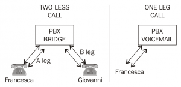

Бывают случаи, когда участников больше двух, например, если Франческа звонит  Джованни, а затем приглашает третьего человека присоединиться в  трехстороннем звонке. В данном случае жаргон звучит так: от Франчески к АТС - это «нога». Все остальные ветви, которые возникли из-за вызова Франчески, в данном  случае и ветвь вызова от УАТС к Джованни, и ветвь вызова от АТС к  третьему лицу, все это ветви B (то есть нет понятия "C" нога "," нога D  "и т. д. Все они ноги" B ").

**IVR, интерактивное голосовое меню (система)**

IVR - это те системы голосового (а вскоре и видео) меню, к которым мы так  привыкли, когда пытаемся связаться со службой поддержки нашего оператора мобильной связи, например: «Чтобы узнать о наших последних  предложениях, нажмите 1, чтобы прослушать рождественские поздравления от нашего оператора». Генеральный директор, пожалуйста, нажмите 2, чтобы  поговорить с нашим техническим отделом, пожалуйста, нажмите 3, чтобы  перейти в наш административный отдел для выставления счетов и счетов,  нажмите 4. Чтобы воспроизвести это меню, нажмите 5 ". Хорошо, IVR могут быть неприятными, но они также полезны.

Звонок в IVR, по крайней мере, изначально является односторонним вызовом, но  затем путь может превратиться в двухсторонний или трехсторонний, если вы переведены на оператора, который, возможно, через некоторое время  пригласит торгового представителя на звонок.

«Интерактивность» IVR с вызывающим абонентом почти всегда основана на том, что звонящий нажимает цифры на панели набора номера. Также все чаще используются системы автоматического распознавания речи (ASR), которые могут понимать, что говорит звонящий. Это распознавание обычно выполняется в ограниченной области знаний,  например, после вопроса «из какого штата вы звоните?» IVR с включенной  функцией ASR может понять, что звонящий говорит имя штата. В будущем, вероятно, будет выпущен ASR, обеспечивающий хорошую надежность при разговоре в «свободной форме», но технологии пока нет.

В любом случае логика IVR реализована в виде дерева, где от начального  корня вызывающий абонент может перемещаться по ветвям вперед и назад,  выбирая (через панель набора номера или голосом) вариант из тех, которые ему представлены.

**Расширения, контексты и профили**

Это еще один источник большой путаницы. Если вы новичок в FreeSWITCH, забудьте о значении, которое вы использовали для обозначения слова «расширение». В FreeSWITCH «расширение» - понятие нематериальное. Его можно понимать как «группу инструкций в контексте». Хорошо, это оставляет нам проблему того, что такое контекст. Контекст - это именованный набор расширений. Таким образом, здесь у нас есть циклическое определение, в котором контексты и расширения определяют друг друга.

Потерпите меня, и через пару абзацев мы со всем этим покончим.

FreeSWITCH имеет «профили». Профиль - это набор конфигураций, связанных с определенной парой IP-адреса и порта. Например 192.168.1.12:5060 - это профиль,

192.168.1.13:5060 - это другой профиль, 192.168.1.12:5061 - третий профиль. Каждый профиль может содержать конфигурации, полностью отличающиеся от конфигураций других профилей. Одна очень важная такая конфигурация, содержащаяся в профиле, - это контекст, в который будет поступать входящий вызов. Вызов всегда поступает в профиль, например, на пару адрес: порт. Итак, допустим, пара адрес: порт - это входной шлюз для определенного профиля. После того, как вызов поступил в профиль, FreeSWITCH первым делом ищет в этом профиле конфигурацию, которая определяет, в какой контекст должен  входить вызов.

Допустим, звонок поступает на 192.168.1.12:5060. Мы назвали этот профиль «myprofile», и в XML-конфигурации этого профиля определено, что используемый контекст - «mycontext». Это означает, что входящий вызов будет обрабатываться только расширениями  (наборами инструкций), содержащимися в коллекции расширений mycontext  (контексте). То есть  входящий вызов будет выполняться в контексте, определенном в профиле, и у него нет возможности получить доступ к чему-либо, что находится вне  этого контекста.

Контекст - это тюрьма звонка. Это имеет очевидные преимущества в плане безопасности, логики и  практического применения: например, входящие вызовы в профиль, доступный нашим коллегам из внутренней локальной сети, будут направляться в  контекст, который дает функцию внутренних офисных вызовов, а также  позволяет доступ к PSTN, потому что мы хотим, чтобы наши сотрудники  имели право совершать внутренние и международные звонки. С другой стороны, вызовы, которые поступают в профили с общедоступным  адресом в Интернете, то есть вызовы, которые достигают нас, проходя  через маршрутизатор извне нашей внутренней локальной сети, эти вызовы  направляются в контекст, который позволяет только звонок, который нужно  соединить с телефоном одного из наших коллег. Этот конкретный профиль будет иметь только функцию, позволяющую внешним  входящим вызовам достигать внутреннего телефона, без какой-либо  возможности инициировать вызовы PSTN. То есть посторонние не могут использовать наш платный шлюз для выхода в ТфОП.

Итак, другой адрес: пара портов, другой профиль, другой контекст. На самом деле это так просто!

Теперь пора посмотреть, что это за «расширения». Сверху мы знаем, что каждое расширение - это набор инструкций. Когда вызов поступает в контекст (контекст - это набор расширений), самое  важное в каждом расширении: применяется ли это расширение к входящему  вызову? Или с точки зрения звонка: вводить ли я этот добавочный номер? Подходит ли мне это расширение?

У каждого расширения есть одно свойство, «условие», которое определяет, применимо ли это расширение к вызову. Например, если вызов войдет в этот добавочный номер и пройдет через шаги,  определенные инструкциями, содержащимися в добавочном номере. Расширение можно рассматривать как контейнер инструкций, и вызов должен  удовлетворять "условию" расширения, чтобы войти в него и пройти через  инструкции внутри него.

Итак, extension == список инструкций. Чтобы ввести добавочный номер, вызов должен удовлетворять «условию».

И «условие», что такое условие? Условие - это регулярное выражение (регулярное выражение), применяемое к одному атрибуту вызова. Если это регулярное выражение совпадает (например, если оно успешно  описывает атрибут вызова), вызов войдет в добавочный номер и выполнит  инструкции.

Посмотрим на пример. Звонок входит на 192.168.1.12:5060, «мой профиль». В конфигурации XML «myprofile» определяется контекст «mycontext». В «mycontext» указано множество расширений, каждое из которых имеет свое «условие».

Первое из этих расширений имеет очень простое условие: регулярное выражение «^ 1010 $» должно проверяться на «destination_number». Таким образом, это регулярное выражение будет успешным, оно будет  соответствовать, если атрибут «destination_number» вызова является  точной строкой «1010» (курсор означает начало строки, знак доллара  означает конец строки. Итак, «1010» - это именно то, что должно быть  между началом и концом строки).

Если входящий вызов должен был быть направлен на номер назначения 1010,  тогда вызов войдет в этот добавочный номер и выполнит содержащиеся в нем инструкции.

Эти инструкции называются «действиями» на жаргоне FreeSWITCH и могут быть любыми. Например: создать переменную и присвоить ей значение. Прочтите другую переменную, примените к ней регулярное выражение, чтобы оно  преобразовалось во все заглавные буквы, создайте другую переменную и  присвойте ей это значение. Ответьте на входящий звонок, например, снимите трубку. Воспроизведите для звонящего предварительно записанное сообщение. Создайте другой, новый исходящий вызов, а затем присоедините его (например,  установите мост) к входящему вызову, чтобы вызывающий абонент из  входящего вызова и вызываемый из исходящего вызова могли разговаривать  друг с другом. Положите трубку. Запросить базу данных. Доступ к веб-серверу. Прочтите или напишите файл. и т. д. и т. д.

Действия (которые всегда содержатся внутри расширения, "свободные" действия не  существуют) действительно могут делать что угодно.

Все остальное, профили, контексты, расширения, условия, регулярные  выражения, - это отличные способы хорошо организовать ваши действия и  построить логику и потоки выполнения. Кроме того, вызов может соответствовать многим расширениям (например, может  удовлетворять условию более чем одного расширения), и во многих случаях  ему будет разрешено вводить многие или все совпадающие расширения, а  также выполнять действия, содержащиеся в каждом из этих расширений. . Мы еще увидим об этом.

**Переменные**

Переменные в FreeSWITCH связаны практически с чем угодно. Вы можете думать о переменных как о атрибутах чего-то. Например, до того, как мы определили «destination_number» как атрибут входящего  («A leg») вызова, и мы использовали его как строку, к которой мы  применили «условие» (regex) расширения, чтобы решить, если это действия  расширения будут выполнены при вызове, или если расширение (и его  действия) должно быть пропущено из-за того, что его условие «не  совпадает» со строкой, содержащейся в переменной «destination_number». «Переменные» - это официальное название всех этих атрибутов вызова или сеанса.

Например, входящий вызов имеет большое количество связанных переменных,  называемых «переменными канала», или «переменными участка вызова», или  просто «переменными». Эти  переменные канала простираются от «номера назначения» (мы видели это) до «исходной сети вызывающего абонента», от «какой аудиокодек  используется» до «в какое время был получен вызов», от «какого типа  пользовательского агента. (например, модель телефона) указывает, «какие  заголовки SIP были частью входящего сетевого пакета INVITE». И не только эти, скажем так, «естественные», «описательные», «объективные» переменные. Мы также можем создавать и назначать всевозможные произвольные переменные и связывать их с нашим вызовом. Например, звонок был инициирован «группой продаж». Или звонок направлен в «группу поддержки». Или стоимость минуты разговора 5 центов. Или максимально допустимая продолжительность этого вызова составляет 600 секунд. и т. д. и т. д.

Все переменные (как «исходные», так и «назначенные») могут быть проверены регулярными выражениями в условии расширения. Таким образом, у нас может быть логика, согласно которой, если это рабочий  день, в рабочее время и звонок предназначен для группы продаж, тогда  звонят телефоны Джона, Рехана и Джованни и соединяют звонок с первым,  кто отвечает.

**Переменные профиля вызывающего абонента**

Некоторые переменные, которые мы всегда находим в вызове (мы также говорим, что  эти переменные являются частью «профиля вызывающего абонента»):

- имя пользователя
- диалплан
- caller_id_name
- caller_id_number
- callee_id_name
- callee_id_number
- network_addr
- ани
- aniii
- rdnis
- destination_number
- источник
- uuid
- контекст

Некоторые имена переменных в профиле вызывающего абонента могут быть вам  непонятны прямо сейчас, но вы найдете много информации позже в этой  книге и во всей онлайн-документации (мы, разработчики, тоже проверяем  онлайн-документы, мы не запомнить все и вся переменные, их сотни;)).

Что характерно для переменных профиля вызывающего абонента, так это то, что вы используете их в «поле» «условия» по их простым именам, без  специального синтаксиса.

Почему мы это указываем? Потому что переменные в FreeSWITCH обозначаются специальными синтаксисами $  {varname} или $$ {othervarname} (мы увидим разницу между двумя  синтаксисами позже).

Таким образом, в качестве бонуса для ваших пальцев вы можете сэкономить время на вводе и получить более приятный и читаемый план набора, если вы  используете переменные профиля вызывающего абонента в поле условия:

<extension name = "Local_Extension_Skinny">

<condition field = "destination_number" expression = "^ (11 [01] [0-9]) $">

<action application = "bridge" data = "skinny / internal / $ {destination_number}" />

</condition> </extension>

Как вы можете видеть, мы написали «destination_number» в поле условия, в то время как нам пришлось ввести его полностью как «$  {destination_number}» при использовании в другом месте (здесь, в  действии, выполняемом, если условие выполнено).

Все переменные профиля вызывающего абонента доступны только для чтения (то  есть вы не можете их изменить) и назначаются автоматически в начале  вызова. Они описывают сам звонок.

**«Нормальные» переменные**

Большинство переменных FreeSWITCH обозначаются синтаксисом $ {varname}. Переменные можно создавать, присваивать и переназначать. Фактически, присвоение значения переменной создает ее, если она еще не существует. Если он существует, он переназначает его на новое значение. <action application = "set" data = "mystring = 'Rehan Allahwala'" />

<action application = "set" data = "mystring2 = SuzanneBowen" />

<action application = "set" data = "mystring2 = $ {mystring}" />

Приложение «устанавливает» присваивают переменные. Здесь мы видим, как это работает в диалплане «действия».

Когда мы создаем или переназначаем переменную, мы используем ее имя (без синтаксиса $ {}). Внутри аргумента «данные» действия «установить» мы используем знак равенства  (=), чтобы отделить имя переменной от ее (нового) значения. Одиночные кавычки используются для заключения значения, если оно содержит пробелы.

Когда мы хотим использовать значение переменной, мы используем синтаксис доллара.

Итак, в предыдущем примере мы сначала присвоили значение переменной с именем «mystring» (создавая ее, если она не существует). Затем мы присваиваем значение переменной mystring2. В последней строке мы переназначаем переменную mystring2, давая ей значение, содержащееся в переменной mystring. Значение $ {mystring2} теперь "Rehan Allahwala".

Все переменные могут использоваться всеми модулями и частями FreeSWITCH. Что это значит? Это, например, когда пользователь, который является членом группы «продажи», инициирует вызов, вы можете установить переменную для этого вызова. Затем вы можете использовать один из модулей записи сведений о звонках, чтобы отслеживать эту переменную, помещать ее в CDR и позволять вашей  компании идентифицировать центры затрат.

Переменные могут быть созданы нами из ничего, или они могут быть автоматически  созданы FreeSWITCH на основе информации, присущей вызовам, окружающей  среде, времени суток и т. Д.

Некоторые переменные отражают значения из различных файлов конфигурации. Большинство переменных из файлов конфигурации доступны для записи. Например, мы можем установить значение по умолчанию для нашего идентификатора  станции (то есть назначить название нашей собственной компании) при  отправке факсов, а затем мы можем переопределить его, переназначив его  на «ACME co» в диалплане, когда мы используем тот же сервер FreeSWITCH  как отправить факс для клиента.

**Переменные "препроцессора"**

Это переменные, обозначенные синтаксисом $$ {varname}. В каком-то смысле это не настоящие переменные, но они действуют как переменные только для чтения. Вы назначаете их в одном из файлов конфигурации FreeSWITCH  (/usr/local/freeswitch/conf/vars.xml), а затем они буквально заменяются  при запуске, когда встречаются. Это точно так же, как конструкция #define в препроцессоре C или команда «Найти и заменить» в текстовом редакторе.

<X-PRE-PROCESS cmd = "set" data = "hold_music = local_stream: // moh" />

В этом примере, редактируя файл конфигурации vars.xml, вы изменяете  значение, которое будет подставлено во всех файлах конфигурации (включая диалплан) при обнаружении "$$ {hold_music}". Если вы затем напишете в диалплане:

<action application = "set" data = "mystring = $$ {hold_music}" />

это будет точно так же, как если бы вы написали:

<action application = "set" data = "mystring = local_stream: // moh" />

Поскольку на самом деле это процедура текстового поиска и замены, которая выполняется один раз в

Запуск FreeSWITCH, если вы изменяете переменную препроцессора в vars.xml, вы  ДОЛЖНЫ перезапустить FreeSWITCH, чтобы активировать изменения (в этом  случае перезагрузки конфигурации без перезапуска FreeSWITCH  недостаточно).

**FS_CLI и консоль, управляющая FreeSWITCH**

Существует так много способов управлять FreeSWITCH в реальном времени и заставлять его делать то, что вы хотите. Вы можете писать приложения, сценарии, взаимодействовать FreeSWITCH с  базами данных и устаревшими системами ... Какие бы средства вы ни  использовали для интеграции своей платформы, вы будете время от времени  возвращаться к FreeSWITCH Command LIne (CLI). И многие администраторы FreeSWITCH используют только интерфейс командной строки для своих повседневных задач.

**/ usr / local / freeswitch / bin / freeswitch -u freeswitch -g freeswitch -c**

Если вы запускаете FreeSWITCH на переднем плане (например, используя  параметр «-c»), после короткой паузы все сообщения запуска  прокручиваются, и вы в конечном итоге получаете команду консоли  FreeSWITCH:

 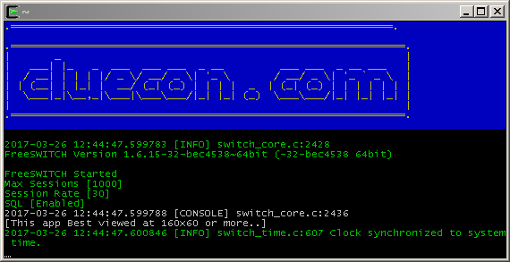

Гораздо чаще, скажем, почти всегда, если вы не отлаживаете сообщения запуска,  вы запускаете FreeSWITCH другим способом, поэтому он переходит в фоновый режим в качестве надлежащего сервера (демона), без управляющего  терминала.

Производственная система обычно запускается так:

  **/usr/local/freeswitch/bin/freeswitch -u freeswitch -g freeswitch**

  **-nonat -ncwait** 

Через несколько секунд эта команда завершится, нам сообщат идентификатор процесса FreeSWITCH, а затем ... ничего не произойдет. Да, все в порядке, FreeSWITCH работает в фоновом режиме и готов принимать  вызовы и управлять ими, и мы можем взаимодействовать с ним с помощью  утилиты fs_cli, имитируя встроенную консоль FreeSWITCH.

  **/usr/local/freeswitch/bin/fs_cli**

Использование fs_cli в системе, в которой уже запущен FreeSWITCH, немедленно дает нам контроль:

 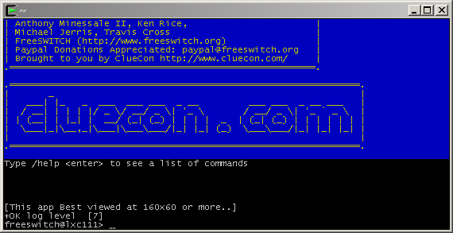

**Выход из консоли убивает FreeSWITCH**

Наиболее важное различие между fs_cli и реальной консолью FreeSWITCH (например,  когда вы запускаете FreeSWITCH на переднем плане) заключается в том, что единственный способ выйти из реальной консоли FreeSWITCH - это закрыть  FreeSWITCH. Это сложно,  потому что почти во всех других аспектах они (fs_cli и фактическая  консоль FreeSWITCH) выглядят и ведут себя одинаково. Проблема в том, что при выходе из fs_cli FreeSWITCH продолжает работать в  фоновом режиме, принимая вызовы и т. Д. И вы всегда можете повторно  запустить fs_cli и повторно подключиться к нему (как терминал ssh к  удаленному серверу). ОСТОРОЖНО, если вы выйдете из фактической консоли FreeSWITCH, вы завершите работу  самого FreeSWITCH, и вам нужно будет перезапустить его.

**Некоторые полезные команды CLI**

Вы можете использовать большинство этих команд как из реальной консоли, так и из fs_cli. После каждой команды нажимайте клавишу ENTER.

| **команда**                      | **имея в виду**                                              |
| -------------------------------- | ------------------------------------------------------------ |
| ... (три последовательных точки) | выйти из fs_cli. При использовании с консоли отключение FreeSWITCH |
| ctrl-d                           | выйти из fs_cli                                              |
| выключение fsctl                 | выключить FreeSWITCH                                         |
| хупалл                           | повесить все звонки                                          |
| fsctl loglevel [0-7]             | изменить, какие сообщения журнала визуализируются            |
| положение дел                    | рассказывает основную статистику                             |
| версия                           | какая кодовая база                                           |
| показать каналы                  | визуализировать все этапы вызова по очереди, индивидуально   |
| показать звонки                  | визуализировать все ветви вызова, сгруппированные по полным параллельным вызовам (A + B) |
| Помогите                         | до странности сбивает с толку и ошеломляет, пока вы не знаете, о чем он печатается. Попробуй сам! |

В конечном итоге вы будете часто использовать команду «fsctl loglevel»,  которая позволяет вам выбрать «уровень» ведения журнала FreeSWITCH. Сервер FreeSWITCH может генерировать огромное количество информации о своей  внутренней работе, большая часть которой не представляет интереса при  нормальной работе. Обычно  вы используете уровень журнала 3: все сообщения, отнесенные к категории  «ОШИБКА» или даже более важные (например, уровень 2, «КРИТИЧЕСКИЙ»),  визуализируются. Многим  администраторам нравится запускать свои FreeSWITCHES на уровне журнала  4, визуализируя сообщения, начиная с уровня «WARNING». Но когда вы хотите понять причину проблемы или сообщить об ошибке, вы  повышаете уровень журнала до 7, «DEBUG», а затем копируете и вставляете  все, что будет прокручиваться в вашем терминале (или что будет записано в файл журнала).

Строки журнала по умолчанию раскрашены по уровню логирования, вы скоро  научитесь замечать красные (ОШИБКА или более важный) и фиолетовый  (ПРЕДУПРЕЖДЕНИЕ) сообщения из менее тревожных синей (NOTIFY), зеленой  (INFO) и желтой (DEBUG) строк. .

**Настройте SIP и сделайте первые звонки в демонстрационном диалплане**

Мы почти готовы к настоящим эмоциям, когда что-то звенит и мигает. Сразу после установки FreeSWITCH получает демонстрационный пример конфигурации с множеством функций. Был разработан очень сложный диалплан, с которым вы можете поиграть и почувствовать всю мощь FreeSWITCH.

**NB:** **Этот диалплан - всего лишь демонстрация, не используйте его в продакшене.** **Слишком сложен и имеет слишком много функций, вы об этом не знаете, и поэтому находится вне вашего контроля.** 

Демо-пример диалплана и конфигурации - это просто демо-примеры. Когда вы закончите играть с ними, удалите их и создайте что-то подходящее для вашего варианта использования. Если вы не можете, попросите кого-нибудь другого, друга или консультанта, сделать это за вас. Любое другое поведение было бы глупо и опасно с юридической и финансовой точки зрения. Вы были предупреждены! :)

**Изменить пароль демонстрационного примера**

Первое, что нужно сделать при новой установке, - это изменить пароль по  умолчанию для демонстрационных пользователей (пользователи, пароли и все другие концепции будут разъяснены в главе 4 , *User Directory, SIP и Verto,* а также в оставшейся части этой книги). Отредактируйте файл /usr/local/freeswitch/conf/vars.xml:

 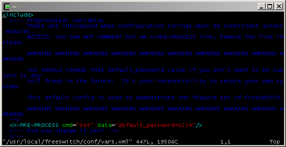

Измените «1234» на что-нибудь другое. Если вы измените его на что-то легкое или умеренно сложное, вас взломают через 20 минут. Это, вероятно, не имеет финансового значения, пока вы не добавите **шлюз PSTN, который** они могут использовать за **ВАШИ РАСХОДЫ** , но, пожалуйста, рассмотрите юридические последствия, если кто-то  использует ваш сервер для создания другого типа трафика, возможно,  некоторых **террористических** SIP-вызовов? Затем не торопитесь, объясняя все это ФБР в течение следующих 3 лет. Не торопитесь, у них есть время. Итак, выберите случайную строку надежной длины. Если вы сомневаетесь, установите и используйте uuidgen, он делает очень хорошие пароли. В Debian из командной строки root: **apt-get install uuid-runtime**  

Затем вы выполняете uuidgen:

  **uuidgen**

​    **a6333e94-0608-4abf-ba82-b0f0f13ef986**

Хороший пароль, не правда ли? В любом случае запоминать его необязательно, достаточно просто вырезать и вставить:

 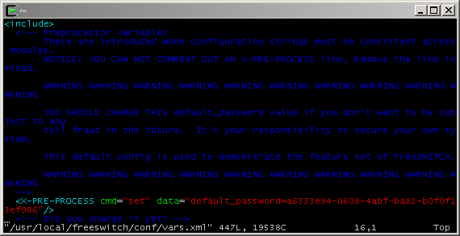

Затем сохраните файл и перезапустите FreeSWITCH (это переменная  препроцессора, вы ДОЛЖНЫ перезапустить FS, чтобы изменения вступили в  силу).

В fs_cli или консоли введите: **fsctl shutdown**  

А затем перезапустите FreeSWITCH, как вы это делали ранее.

**Настроить Linphone на рабочем столе**

Linphone - прекрасное SIP-приложение, полностью кросс-платформенное (Windows,  OSX, Linux, Android, iOS), испытанное в битвах на миллионах установок, с открытым исходным кодом и в основном разработанное и коммерчески  поддерживаемое хорошими людьми из французской компании Belledonne.

Примеры пользователей демо-версии именуются 20 последовательными номерами 1000-1019. То есть 1001, 1002 ... 1019. Их общий пароль - это тот, который мы только что отредактировали в vars.xml: a6333e94-0608-4abf-ba82-b0f0f13ef986. Чтобы настроить учетную запись SIP в нашем Linphone, нам понадобится IP-адрес нашего сервера FreeSWITCH, в нашем случае это адрес 192.168.1.111. Обратите внимание, что мы будем запускать и сервер FreeSWITCH, и все клиенты SIP в одной локальной сети, и мы открываем все брандмауэры на всех  задействованных машинах. Позже вы узнаете, как создавать более сложные топологии.

Создайте учетную запись SIP в Linphone (Меню -> Параметры -> Настройки  -> Управление учетными записями SIP), пользователь должен быть от  1000 до 1019, в нашем случае мы выбираем 1010 (обратите внимание, что вы ДОЛЖНЫ написать «sip:» перед идентификатором SIP и прокси-сервером SIP. Адрес):

 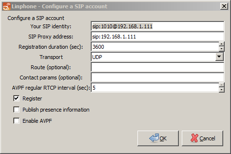

Это пример Windows, на других платформах интерфейс конфигурации будет более или менее таким же. Как только вы нажмете ОК, в другом диалоговом окне будет запрошен пароль. Будьте готовы вырезать и вставить пароль в диалоговом окне до истечения времени ожидания. Если истечет время ожидания, отредактируйте учетную запись SIP еще раз,  сохраните ее, и вам снова будет предложено ввести пароль.

 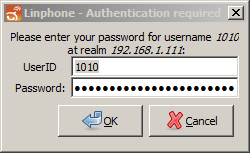

Если все прошло успешно, ваш Linphone зарегистрируется на сервере FreeSWITCH и будет готов совершать и принимать звонки.

 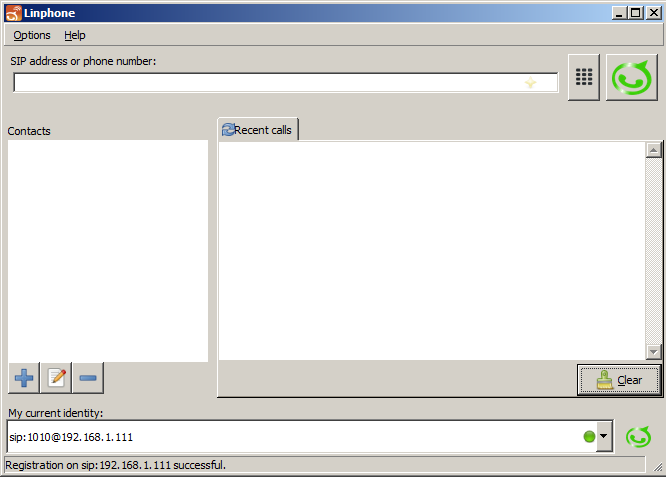

**Настроить "настоящий" телефон SNOM SIP**

Когда телефон SNOM (или другой SIP) загружается, он отображает собственный IP-адрес. Используйте веб-браузер и настройте учетную запись SIP («Идентификация» на языке SNOM)

 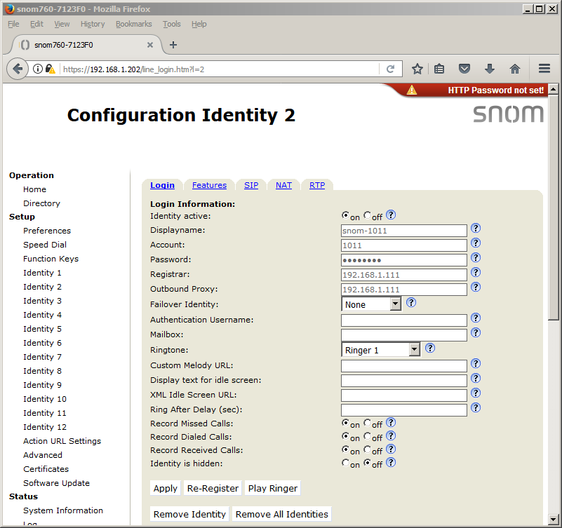

Затем нажмите «Применить» внизу.

Теперь перейдите на вкладку «RTP» и выключите шифрование RTP (мы рассмотрим шифрование позже в книге). Нажмите «Применить».

 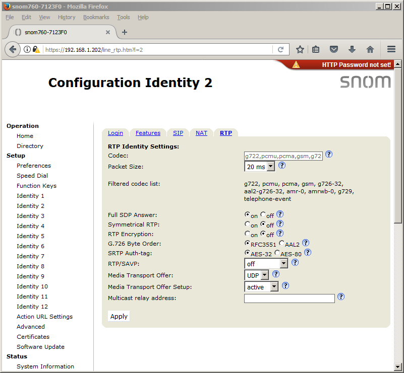

Если все прошло успешно, телефон SNOM теперь зарегистрирован на сервере FreeSWITCH. Не забудьте «Сохранить» навсегда всю конфигурацию SNOM, когда вас  попросят, иначе вам придется начать заново при следующей загрузке  телефона.

**Настроить Linphone на Android**

Создайте новую учетную запись, коснувшись меню или «Ассистента». Заполните все обязательные поля.

 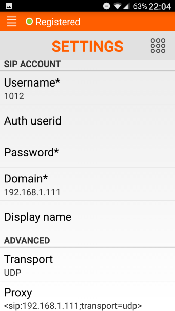

Поле «Прокси» заполнится автоматически. Затем нажимаю на поле «Пароль» и вставляю пароль (я помещал его в файл,  переносил на смартфон, а потом ... копировал и вставлял).

 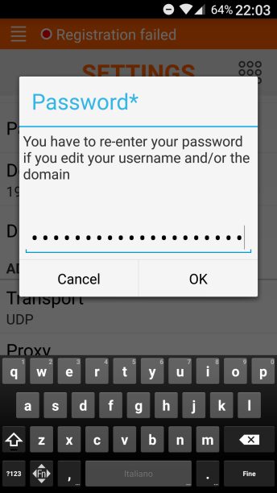

Затем нажмите ОК.

 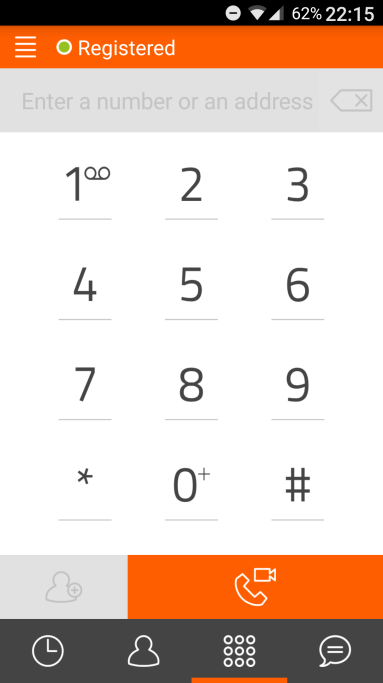

Если все прошло хорошо, Android Linphone зарегистрируется на сервере FreeSWITCH и будет готов по вашим командам.

**А теперь ... Веселье, веселье, веселье с демонстрационным планом набора**

Вы найдете основной файл демонстрационного диалплана в

/usr/local/freeswitch/conf/dialplan/default.xml. Это делает чтение интересным. Очевидно, вы не сможете понять большую часть деталей, если это ваше первое  знакомство с FreeSWITCH, но комментарии и ваше «чутье» заставят вас во  многом разобраться.

**9386, Веселые подсказки**

Откройте основной файл диалплана в текстовом редакторе и найдите «9386».

 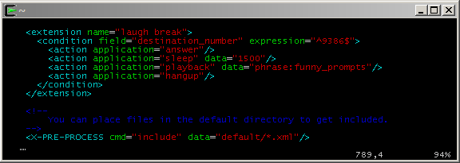

Вы найдете его в конце файла. Мы видим, что «условие» - это точное совпадение «destination_number» с  «9386», без префиксов, без завершающих цифр (курсор - начало строки,  доллар - конец строки). Если destination_number (это переменная в «профиле вызывающего абонента»,  поэтому мы можем использовать его в «поле» условия без синтаксиса $ {})  входящего вызова совпадает с 9386, FreeSWITCH ответит на вызов  (например, снимет трубку и начать обмен пакетами медиапотоков), засыпать на полторы секунды, затем воспроизвести вызывающему объекту объект,  называемый

фраза: funny_prompts (далее в книге мы увидим, что фраза - это именованный набор звуковых файлов). После всего воспроизведения, если вызывающий абонент еще не завершил вызов, FreeSWITCH повесит трубку.

(Последняя строка на рисунке означает, что все файлы с расширением xml,  содержащиеся в подкаталоге default, будут считаны и «добавлены» к  основному диалплану. Это удобно для организации, мы увидим).

Итак, это первый вызов нашего недавно установленного FreeSWITCH, давайте  позвоним по номеру 9386 с одного из наших зарегистрированных телефонов и послушаем серию забавных подсказок, воспроизводимых нам один за другим.

**1000 ... 1019, с телефона на местный звонок**

Следующим естественным шагом будет звонок с одного из наших телефонов на другой. «Расширение», отвечающее за такого рода вызовы между пользователями демо-версии,  очень сложное, потому что оно включает в себя множество функций.

Откройте основной файл демонстрационного диалплана в

/usr/local/freeswitch/conf/dialplan/default.xml с помощью редактора и выполните поиск по запросу «Local_Extension».

 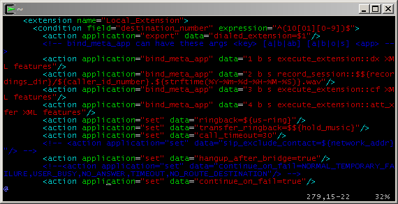

Мы не будем следить за действиями этого расширения шаг за шагом, это слишком сложно и сложно для этой части книги. Но посмотрите на состояние. Регулярное выражение в поле «expression» соответствует значению  «destination_number» для 1000 ... 1019, точно такая же серия, как мы  знаем, для демонстрационных пользователей. Таким образом, если с телефона вы звоните на один из других телефонов, ветвь  входящего звонка (ветвь A, звонок, исходящий с телефона) достигнет  FreeSWITCH, перейдет в план набора, соответствует этому добавочному  номеру и оборудованию внутри этого добавочный номер проверит,  зарегистрирован ли телефон вызываемого пользователя в FreeSWITCH, если  он зарегистрирован, FreeSWITCH будет инициировать новый участок вызова  (участок B) от самого себя до телефона вызываемого абонента.

Если вызываемый абонент отвечает, FreeSWITCH соединяет (соединяет) две ветви вызова и начинает перемещать пакеты данных мультимедийных потоков туда и обратно между вызывающим и вызываемым абонентами. Если вызываемый абонент не отвечает, или если его телефон даже не  зарегистрирован, FreeSWITCH соединит входящий вызов (ветвь A) с  голосовой почтой вызываемого абонента (чтобы он не отправлял второй  ответвление, голосовая почта является модулем FreeSWITCH, никаких  внешних вовлечены субъекты).

Теперь вы знаете сюжет, вы можете протестировать различные сценарии, позвонить на другой телефон, ответить, не отвечать, набрать неправильный номер,  позвонить на незарегистрированный телефон, позвонить одному из  стандартных пользователей (1000 ... 1019) для который вы не настраивали  на телефоне. Удачи уже!

**5000, Вызов демонстрационного примера IVR**

IVR, интерактивный голосовой ответ, автосекретарь, личный помощник,  голосовое меню, голосовое дерево - одна из вещей, с которыми все мы  очень хорошо знакомы в этом странном обществе последних десятилетий. От колл-центров до систем голосовой почты, от тревожного звонка нашей  молодежи (отцовской юности?) До информационных систем аэропорта, мы  привыкли взаимодействовать с (синтетическим?) Голосом с помощью цифр,  которые мы нажимаем на панели набора номера.

Итак, позвоните 5000 с одного из телефонов и взаимодействуйте с простым, но полным IVR с множеством опций, меню и подменю. Некоторые варианты, которые вы можете сделать в демонстрационном IVR, также являются самостоятельными расширениями.

Например, если вы нажмете «3» на панели набора номера под капотом, вы перейдете в

Расширение «9664», прослушивание музыки на удержании. Если вы нажмете «2», вы будете переведены на добавочный номер «9196»,  который ответит эхом на ваш голос (полезно для определения того, сколько сетевой задержки для обратного и обратного голосового отключения).

Мы увидим больше о том, как создать IVR и как был построен демонстрационный IVR, позже в книге. А пока давайте поиграемся с этим.

**3000, конференц-связь**

Если вы позвоните на 3000 с разных телефонов, все они будут подключены к одному «конференц-залу». Нет ограничений на количество вызывающих абонентов, которые могут  подключиться к одним и тем же конференц-залам, и вы можете иметь любое  количество разных конференц-залов, работающих одновременно. Абоненты в одних и тех же конференц-залах смогут слышать друг друга, но не будут слышать звонящих в разных комнатах. Кроме того, конференц-залы имеют множество функций, модераторов,  дополнительную авторизацию по PIN-коду и т. Д. В основной комнате,  которую мы создали для демонстрации, вы можете поиграть со своим набором номера и посмотреть, что происходит. Подробнее о конференциях позже в этой книге.

**Пример краткого руководства по диалплану**

В следующей таблице приведен список добавочных номеров и их функции:

| Расширение            | Функция                                                    |
| --------------------- | ---------------------------------------------------------- |
| 1000–1019             | Местные расширения                                         |
| ** + добавочный номер | Перехватывает звонящий телефон (то есть перехват вызова)   |
| 2000 г.               | Группа обзвона образцов: Продажи                           |
| 2001 г.               | Обзвонная группа образцов: Поддержка                       |
| 2002 г.               | Образцы группы звонков: Биллинг                            |
| 3000–3399             | Образцы конференц-залов                                    |
| 4000 или * 98         | Получает голосовую почту                                   |
| 5000                  | Демо IVR                                                   |
| 5900                  | Парк очередей FIFO                                         |
| 5901                  | Получение очереди FIFO                                     |
| 6000                  | Услуги парковщика / поиск, руководство                     |
| 6001-6099             | Услуги парковщика / выдача, автоматический                 |
| 7243                  | Страница многоадресной рассылки RTP                        |
| 0911                  | Пример группового домофона # 1                             |
| 0912                  | Пример группового домофона # 2                             |
| 0913                  | Пример экстренной исходящей конференции                    |
| 9178                  | Пример получения факса                                     |
| 9179                  | Пример передачи факса                                      |
| 9180                  | Проверка звонка, дальний конец генерирует мелодию звонка   |
| 9181                  | Проверка звонка, отправка тонального сигнала UKring        |
| 9182                  | Проверка звонка, отправка музыки в качестве мелодии звонка |
| 9183                  | Ответьте, затем отправьте звонок для Великобритании        |
| 9184                  | Ответьте, затем отправьте музыку в качестве мелодии звонка |
| Расширение            | Функция                                                    |
| 9191                  | ClueCon регистрация                                        |
| 9192                  | Информационная свалка                                      |
| 9195                  | Тест отложенного эхо                                       |
| 9196                  | Эхо-тест                                                   |
| 9197                  | Милливаттный тон (качество тестового сигнала)              |
| 9198                  | Тетрис                                                     |
| 9664                  | Музыка на удержании                                        |

**Резюме**

В этой главе мы познакомились с конфигурацией FreeSWITCH по умолчанию. Среди обсуждаемых тем были следующие:

- Важные концепции, лежащие в основе поведения FreeSWITCH при совершении звонков и почему
- Базовое использование fs_cli , утилиты интерфейса командной строки FreeSWITCH
- Как настроить SIP-устройства для подключения к FreeSWITCH с использованием  предварительно определенных учетных записей пользователей
- Тестирование диалплана по умолчанию путем набора различных добавочных номеров

Теперь обратим внимание на другой важный аспект FreeSWITCH: каталог пользователя.

В следующей главе мы более подробно рассмотрим каталог пользователя FreeSWITCH.