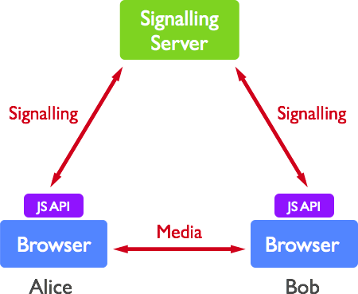
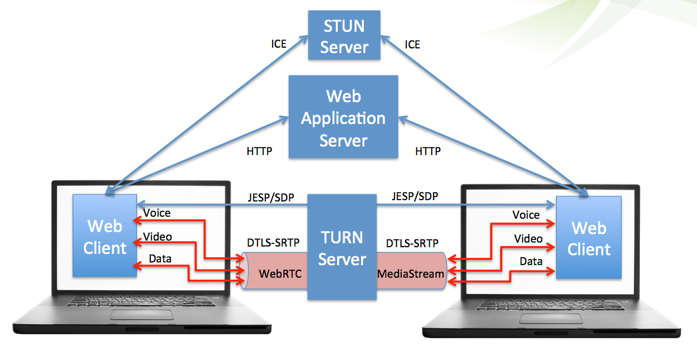
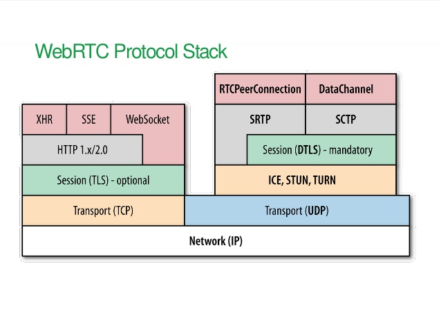
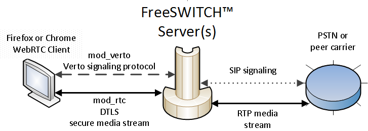
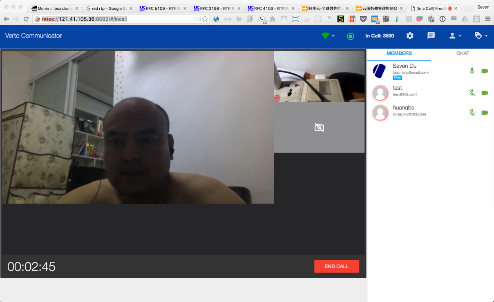
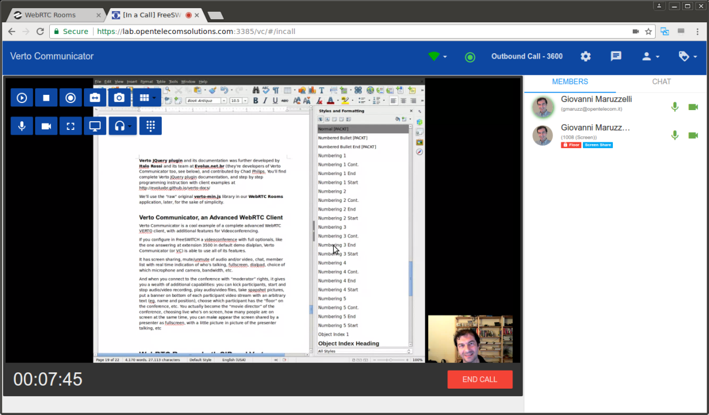
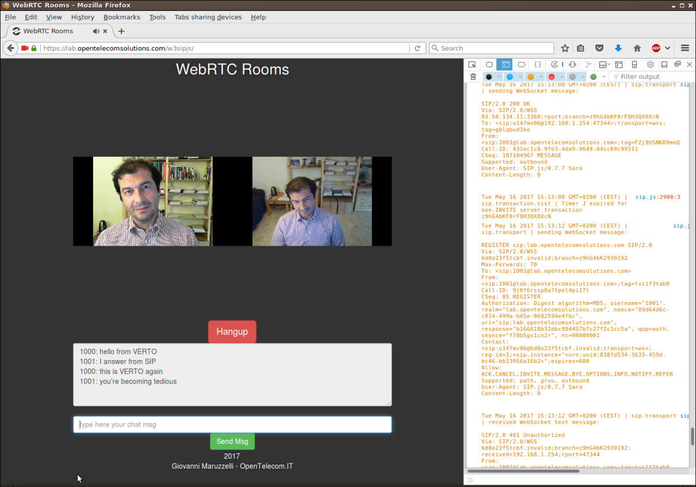
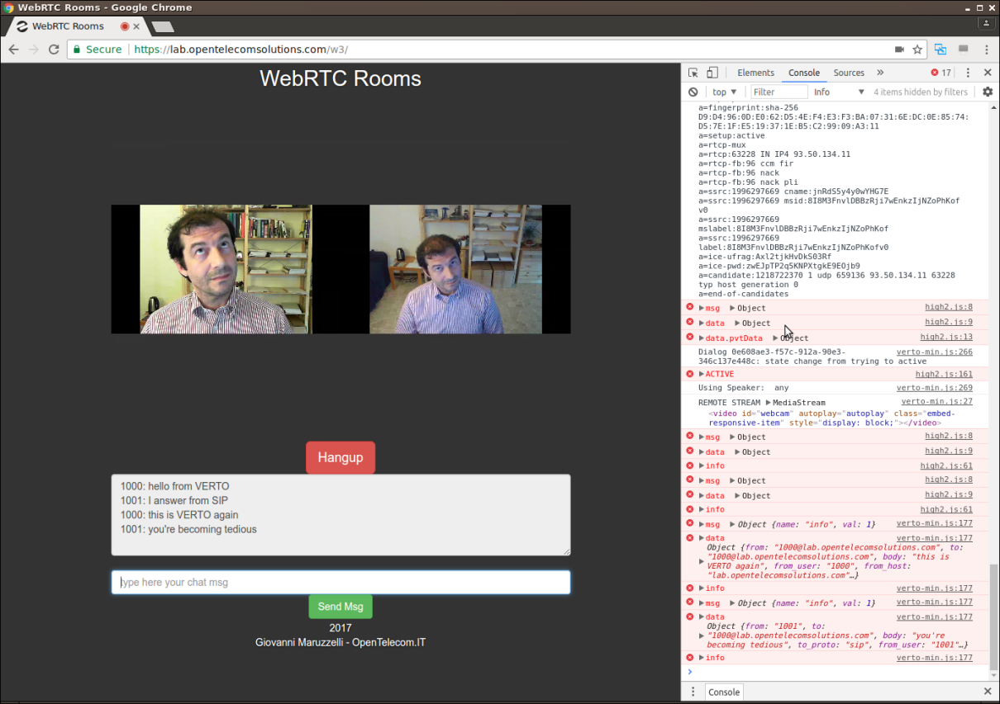
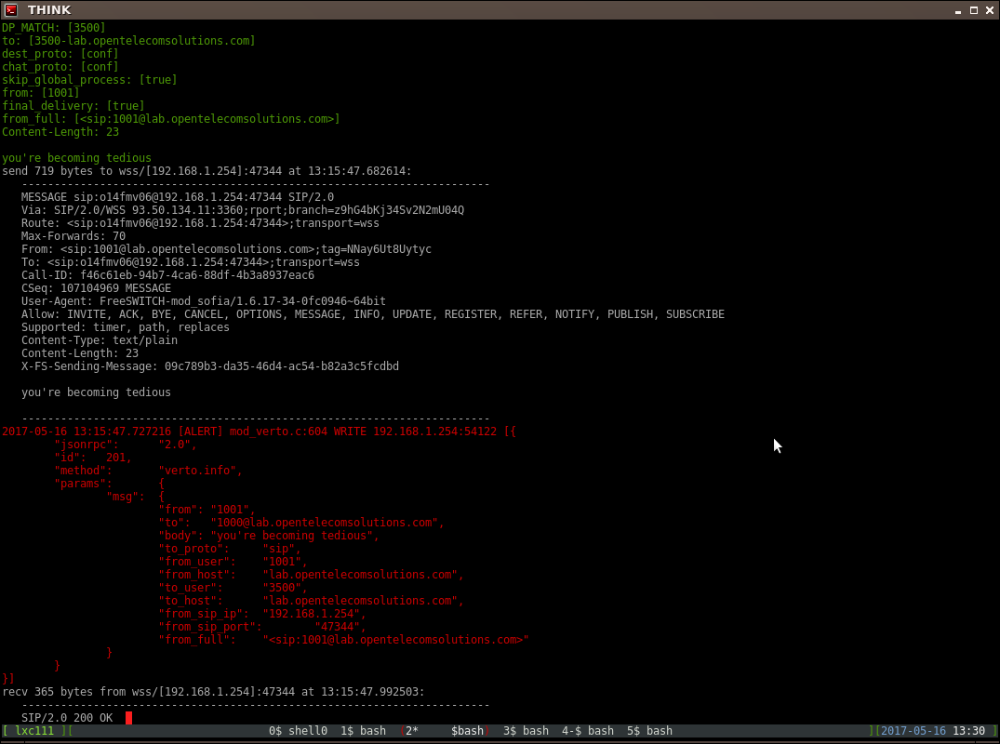

WebRTC, SIP и Verto

WebRTC, коммуникация в реальном времени в видео и аудио, уже работает в более чем миллиарда браузеров. Скоро количество мобильных приложений будет множиться. А WebRTC готов стать уровнем мультимедийной связи, принятым в Интернете вещей (IoT).

FreeSWITCH - это законченное решение WebRTC, позволяющее существующим и устаревшим приложениям обслуживать пользователей по новым каналам. Кроме того, FreeSWITCH, будучи сверхпрограммируемым сервером приложений,  является фундаментом, на котором вы можете создать потрясающий сервис,  определяющий новую концепцию «быстрого обогащения»!

WebRTC - это группа технологий и стандартов для одноранговой потоковой передачи мультимедиа. WebRTC нуждается в дополнительном уровне подписи и управления сеансами, чтобы  действительно быть полезным: каталог пользователей, расположение  пользователей, управление сбоями и т.

FreeSWITCH поддерживает как SIP на WebRTC (протокол сигнализации сеанса, который  управляет миром телекоммуникаций), так и VERTO, новый протокол с  открытым исходным кодом, разработанный для упрощения работы  разработчиков JavaScript.

Мы увидим, как установить, настроить и управлять вашим сервером FreeSWITCH как интегрированной платформой WebRTC, мы рассмотрим Verto Communicator (VC) - удивительно продвинутый и простой клиентский браузер для  видеоконференцсвязи и телеприсутствия.

Затем мы рассмотрим разработку того же приложения, WebRTC Rooms, в двух  неотличимых вариантах: один на основе SIP.js, а другой - на verto.js.

В этой главе мы рассмотрим следующие темы:

Концепции WebRTC

- Шифрование в WebRTC
- WebRTC в FreeSWITCH
- Обоснование протоколов SIP и Verto
- Установка и настройка полной платформы FreeSWITCH WebRTC
- Удивительные функции Verto Communicator
- Как написать тестовое приложение на Verto и SIP.js

**Концепции WebRTC**

WebRTC - это набор стандартов и технологий, которые обеспечивают **одноранговую** передачу аудио, видео и данных, потоковую передачу и обмен. Его первое «приложение-убийца» - видеозвонки и видеоконференции. Его первая реализация находится в веб-браузерах (существует более одного  миллиарда браузеров, совместимых с WebRTC), его технология уже  используется во многих приложениях для смартфонов и, как предполагается, станет основой для мультимедийной коммуникации Интернета вещей (IoT)  (будет быть много миллиардов устройств Интернета вещей с включенным  WebRTC).

В наиболее простой и популярной реализации **браузер** получит доступ к веб-сайту и загрузит страницу, содержащую **Javascript** . Эти функции сценария используют **API-интерфейсы WebRTC** (см. Ниже) для взаимодействия с мультимедийным оборудованием локального  компьютера (микрофоном и камерой) и для потоковой передачи звука и видео на одноранговые узлы и от них.

Основное внимание здесь уделяется **одноранговой сети** .WebRTC не предписывает и не поддерживает ничего, кроме захвата, отправки, получения и воспроизведения потоков. Без сигнализации, без каталога пользователей или служб определения  местоположения, без протокола для согласования установления сеанса связи и разрыва и т. Д.

**WebRTC - это НЕ протокол и не услуга** . Используя только технологии WebRTC, вы должны жестко запрограммировать адреса в  своем приложении на обоих узлах и надеяться, что они будут прослушивать, и приложение будет работать только на этих узлах.

 

Для чего угодно, кроме простейшей демонстрации, **WebRTC нуждается в какой-либо форме протоколов сигнализации и управления сеансами** . Для своего сервиса WebRTC **вы можете принять готовый протокол или изобрести собственный** .

Наиболее распространенным протоколом управления сеансом сигнализации является **SIP** , который управляет всей мировой телекоммуникационной сетью, от  операторов PSTN до операторов мобильной связи и офисных АТС и служб  телефонной связи. Другой широко используемый протокол сигнализации - это **XMPP** , в основном для управления службами обмена мгновенными сообщениями и присутствием.

Существует множество **закрытых проприетарных протоколов** , в первую очередь **протокол** **Skype** . И есть альтернативы с **открытым исходным кодом,** ориентированные на веб-разработчиков и программистов на JavaScript, такие как **Verto от FreeSWITCH** . Вам нужно будет выбрать один или написать свой собственный.

Технологии **WebRTC** воплощены в трех группах интерфейсов прикладного программирования ( **API** ), которые разработчики используют для создания приложений: GetUserMedia  (GUM), RTCPeerConnection (RTCPC или ПК) и RTCDataChannels (RTCDC или  DC).

\* **GetUserMedia** занимается перечислением мультимедийного оборудования на локальном компьютере,  запросом у пользователя разрешения на управление микрофоном и камерой,  получение их потоков и воспроизведение потоков через локальный экран и  динамики. 

\* **RTCPeerConnection** - это перемещение этих аудио- и видеопотоков между определенными одноранговыми узлами. 

\* **RTCDataChannels** - это перемещение произвольных данных (даже структурированных) между определенными одноранговыми узлами. 

WebRTC RTCPeerConnection может (и должен) использовать **ICE** , **STUN** и **TURN** для прохождения через брандмауэры и NAT и в конечном итоге достичь своего партнера.

ICE - это метод, который популяризировал сам WebRTC и набирает обороты. Это настоящая серебряная пуля для всех сетевых проблем, и она работает  безупречно, являясь воплощением многолетней мудрости инженерных услуг  VoIP.

 

**ICE** будет использовать сервер **STUN,** чтобы сообщить приложению, каков его публичный адрес, видимый из Интернета  (например, из-за NAT и брандмауэра), и будет использовать сервер **TURN в** качестве промежуточного ретранслятора в случае одноранговой связи. невозможно или не удается.

Итак, функциональное приложение WebRTC должно:

\* Используйте GetUserMedia API для управления микрофоном и камерой 

\* Используйте протокол сеанса и, возможно, внешние вспомогательные серверы, чтобы найти однорангового узла и установить сеанс 

\* Используйте ICE (а также STUN и TURN), чтобы найти сетевой путь к одноранговому узлу 

\* Используйте RTCPeerConnection для потоковой передачи аудио и видео на / от однорангового узла 

**Шифрование везде**

**Шифрование медиа и потоков данных обязательно** . Полная остановка. Невозможно установить соединение WebRTC без шифрования потоков, которыми обмениваются. Это будут медиапотоки (аудио + видео) и, если они есть, потоки данных. Медиа потоки

зашифрованы как **SRTP** с обменом ключами через **DTLS** . Это делается за вас с помощью API RTCPeerConnection.

 

Но пока вы это делаете, имеет смысл только зашифровать сигнализацию протокола сеанса. Предпочтительным транспортом для такой сигнализации обычно является Secure WebSocket. Вы увидите почти везде префикс URI **WSS: //** (WebSocket Secure) при определении сигнальных серверов и конечных точек WebRTC. Обмен сигналами **WSS** зашифрован с помощью **TLS** (например, как веб- **протокол HTTPS** ). Альтернативой, незашифрованной, является просто **WS** , но она редко используется помимо целей тестирования.

**WebRTC в FreeSWITCH**

Хорошо, хватит абстракций, давайте посмотрим под нашим запоздалым капотом, как FreeSWITCH реализует WebRTC.

FreeSWITCH - это полноценная платформа WebRTC, которая может действовать как шлюз WebRTC, так и сервер приложений WebRTC. Например, FreeSWITCH может подключать клиентов WebRTC к внешним «нормальным»  службам SIP и PSTN (или УАТС), обеспечивая доступ к уже существующим или устаревшим службам для миллиарда браузеров.

В то же время (и это может быть буквально правдой: выступая в качестве  шлюза для некоторых внешних сервисов) FreeSWITCH может напрямую  обслуживать клиентов WebRTC (браузеры и приложения) точно такие же аудио / видео приложения, которые обслуживают «обычные» SIP и Клиенты PSTN,  такие как PBX, IVR, Call-центр, система конференц-связи, телефонная  карта и т. Д. Приложения.

Для FreeSWITCH **WebRTC - это просто еще один вид канала связи, наряду с SIP,** TDM, MGCP, H323, Skype, Jingle и т. Д. Все функции FreeSWITCH изначально доступны через WebRTC.

**Сигнализация WebRTC в FS: SIP и Verto**

Как мы уже видели в этой главе, WebRTC требуется протокол сеанса для дополнения его собственных потоковых возможностей. Этот протокол будет использовать сигнализацию для определения местоположения однорангового узла, установления и прерывания сеансов, управления  присутствием и обмена сообщениями и т. Д. FreeSWITCH поддерживает два  таких протокола: SIP и Verto.

Эти два разных протокола влияют только на то, как написано клиентское  приложение (клиентское приложение - это веб-страница, а Javascript -  загрузка браузера для доступа к FreeSWITCH) и то, как оно «общается» с  FreeSWITCH. Оба протокола предоставляют полный доступ к функциям и услугам FreeSWITCH. Кроме того, оба протокола сигнализации могут использоваться одновременно  разными клиентами, получающими доступ к одной и той же услуге и даже  взаимодействующими друг с другом (например, мы можем проводить  видеоконференцию в FreeSWITCH, к которой одновременно обращается один  клиент WebRTC, «говорящий» по SIP и другому ». Говоря "Verto", в  дополнение к другим клиентам, исходящим из TDM и "обычного" (не WebRTC)  SIP:

 

**Почему SIP и почему Verto?**

Помните: этот выбор влияет только на то, как вы пишете Javascript на  веб-странице, которую браузер загружает для доступа к серверу  FreeSWITCH. Позже в этой  главе мы увидим, что можем иметь одно и то же приложение, написанное для каждого из протоколов, неотличимое с точки зрения и опыта конечного  пользователя.

SIP, хотя и сложный, будет хорошо известен всем программистам, работающим в  сфере телекоммуникаций, с его концепциями сеанса, диалога, транзакции,  знакомыми методами REGISTERINVITE-BYE и т. Д. Это идеальный выбор для  интеграции клиентов WebRTC в сложную среду, и он наслаждается 20-летний  опыт масштабирования, мониторинга, развертывания.

Verto - это совершенно другой опыт: он очень прост и использует программные  конструкции, уже знакомые веб-программистам, такие как структуры данных  JSON. Кроме того, Verto  дополнительно обеспечивает взаимодействие с внутренними API-интерфейсами FreeSWITCH на стороне сервера и двунаправленную синхронизацию структур  данных.

Например, с Verto вы можете иметь структуру данных в FreeSWITCH (скажем, список  участников видеоконференции), которая синхронизируется на всех клиентах  Verto прозрачно и в режиме реального времени, поэтому, если новый  участник входит (даже из PSTN), его присутствие будет немедленно  визуализируется всеми браузерами клиентов Verto без каких-либо действий  на стороне клиента (например, без опроса).

Вы можете воспроизвести это поведение в JavaScript на основе SIP (умный  программист может делать все, что захочет, разве они не все просто  байты?), Используя потоки данных, специальные сообщения, методы push и  т. Д., Но в Verto это нативно и требует всего лишь несколько строк кода.

 

**WebRTC Media Streaming в FS: SRTP**

Независимо от того, какой протокол сигнализации сеанса используется клиентами  WebRTC (SIP или Verto), их потоки мультимедиа всегда будут зашифрованы в соответствии со спецификациями WebRTC. Это будет Secure RTP ( **SRTP** ) с ключами шифрования, отправленными через **DTLS** . Фактически внутри FreeSWITCH один и тот же модуль и исходный код будут  использоваться для шифрования и обслуживания медиапотоков для обоих  типов клиентов WebRTC.

Как было замечено ранее, WebRTC определяет, как передавать и шифровать  мультимедиа, оставляя протокол сеанса на усмотрение разработчика  приложения.

**Установка и настройка WebRTC в ФС**

Для быстрого тестирования Тристан Маэ предоставил сценарий, который  устанавливает все, что необходимо для WebRTC, от самого FreeSWITCH до  сертификатов на веб-сервер и Verto Communicator на недавно развернутом  сервере Debian 8 Minimal Jessie.

Установите базовую ОС на оборудование или на виртуальную машину, ssh на этой  машине, выполните сценарий, и вы готовы подключиться к новому серверу  WebRTC Conference Server:

[h ](https://translate.google.com/translate?hl=ru&prev=_t&sl=en&tl=ru&u=https://freeswitch.org/confluence/display/FREESWITCH/Debian%2B8%2BJessie%23Debian8Jessie-QuickStartFreeSWITCHDemoWithVertoCommunicator#Debian8Jessie-QuickStartFreeSWITCHDemoWithVertoCommunicator)[t ](https://translate.google.com/translate?hl=ru&prev=_t&sl=en&tl=ru&u=https://freeswitch.org/confluence/display/FREESWITCH/Debian%2B8%2BJessie%23Debian8Jessie-QuickStartFreeSWITCHDemoWithVertoCommunicator#Debian8Jessie-QuickStartFreeSWITCHDemoWithVertoCommunicator)[t ](https://translate.google.com/translate?hl=ru&prev=_t&sl=en&tl=ru&u=https://freeswitch.org/confluence/display/FREESWITCH/Debian%2B8%2BJessie%23Debian8Jessie-QuickStartFreeSWITCHDemoWithVertoCommunicator#Debian8Jessie-QuickStartFreeSWITCHDemoWithVertoCommunicator)[p ](https://translate.google.com/translate?hl=ru&prev=_t&sl=en&tl=ru&u=https://freeswitch.org/confluence/display/FREESWITCH/Debian%2B8%2BJessie%23Debian8Jessie-QuickStartFreeSWITCHDemoWithVertoCommunicator#Debian8Jessie-QuickStartFreeSWITCHDemoWithVertoCommunicator)[s ](https://translate.google.com/translate?hl=ru&prev=_t&sl=en&tl=ru&u=https://freeswitch.org/confluence/display/FREESWITCH/Debian%2B8%2BJessie%23Debian8Jessie-QuickStartFreeSWITCHDemoWithVertoCommunicator#Debian8Jessie-QuickStartFreeSWITCHDemoWithVertoCommunicator)[: // f ](https://translate.google.com/translate?hl=ru&prev=_t&sl=en&tl=ru&u=https://freeswitch.org/confluence/display/FREESWITCH/Debian%2B8%2BJessie%23Debian8Jessie-QuickStartFreeSWITCHDemoWithVertoCommunicator#Debian8Jessie-QuickStartFreeSWITCHDemoWithVertoCommunicator)[r ](https://translate.google.com/translate?hl=ru&prev=_t&sl=en&tl=ru&u=https://freeswitch.org/confluence/display/FREESWITCH/Debian%2B8%2BJessie%23Debian8Jessie-QuickStartFreeSWITCHDemoWithVertoCommunicator#Debian8Jessie-QuickStartFreeSWITCHDemoWithVertoCommunicator)[e ](https://translate.google.com/translate?hl=ru&prev=_t&sl=en&tl=ru&u=https://freeswitch.org/confluence/display/FREESWITCH/Debian%2B8%2BJessie%23Debian8Jessie-QuickStartFreeSWITCHDemoWithVertoCommunicator#Debian8Jessie-QuickStartFreeSWITCHDemoWithVertoCommunicator)[e ](https://translate.google.com/translate?hl=ru&prev=_t&sl=en&tl=ru&u=https://freeswitch.org/confluence/display/FREESWITCH/Debian%2B8%2BJessie%23Debian8Jessie-QuickStartFreeSWITCHDemoWithVertoCommunicator#Debian8Jessie-QuickStartFreeSWITCHDemoWithVertoCommunicator)[s ](https://translate.google.com/translate?hl=ru&prev=_t&sl=en&tl=ru&u=https://freeswitch.org/confluence/display/FREESWITCH/Debian%2B8%2BJessie%23Debian8Jessie-QuickStartFreeSWITCHDemoWithVertoCommunicator#Debian8Jessie-QuickStartFreeSWITCHDemoWithVertoCommunicator)[w ](https://translate.google.com/translate?hl=ru&prev=_t&sl=en&tl=ru&u=https://freeswitch.org/confluence/display/FREESWITCH/Debian%2B8%2BJessie%23Debian8Jessie-QuickStartFreeSWITCHDemoWithVertoCommunicator#Debian8Jessie-QuickStartFreeSWITCHDemoWithVertoCommunicator)[i ](https://translate.google.com/translate?hl=ru&prev=_t&sl=en&tl=ru&u=https://freeswitch.org/confluence/display/FREESWITCH/Debian%2B8%2BJessie%23Debian8Jessie-QuickStartFreeSWITCHDemoWithVertoCommunicator#Debian8Jessie-QuickStartFreeSWITCHDemoWithVertoCommunicator)[t ](https://translate.google.com/translate?hl=ru&prev=_t&sl=en&tl=ru&u=https://freeswitch.org/confluence/display/FREESWITCH/Debian%2B8%2BJessie%23Debian8Jessie-QuickStartFreeSWITCHDemoWithVertoCommunicator#Debian8Jessie-QuickStartFreeSWITCHDemoWithVertoCommunicator)[c ](https://translate.google.com/translate?hl=ru&prev=_t&sl=en&tl=ru&u=https://freeswitch.org/confluence/display/FREESWITCH/Debian%2B8%2BJessie%23Debian8Jessie-QuickStartFreeSWITCHDemoWithVertoCommunicator#Debian8Jessie-QuickStartFreeSWITCHDemoWithVertoCommunicator)[h ](https://translate.google.com/translate?hl=ru&prev=_t&sl=en&tl=ru&u=https://freeswitch.org/confluence/display/FREESWITCH/Debian%2B8%2BJessie%23Debian8Jessie-QuickStartFreeSWITCHDemoWithVertoCommunicator#Debian8Jessie-QuickStartFreeSWITCHDemoWithVertoCommunicator)[. ](https://translate.google.com/translate?hl=ru&prev=_t&sl=en&tl=ru&u=https://freeswitch.org/confluence/display/FREESWITCH/Debian%2B8%2BJessie%23Debian8Jessie-QuickStartFreeSWITCHDemoWithVertoCommunicator#Debian8Jessie-QuickStartFreeSWITCHDemoWithVertoCommunicator)[o ](https://translate.google.com/translate?hl=ru&prev=_t&sl=en&tl=ru&u=https://freeswitch.org/confluence/display/FREESWITCH/Debian%2B8%2BJessie%23Debian8Jessie-QuickStartFreeSWITCHDemoWithVertoCommunicator#Debian8Jessie-QuickStartFreeSWITCHDemoWithVertoCommunicator)[r ](https://translate.google.com/translate?hl=ru&prev=_t&sl=en&tl=ru&u=https://freeswitch.org/confluence/display/FREESWITCH/Debian%2B8%2BJessie%23Debian8Jessie-QuickStartFreeSWITCHDemoWithVertoCommunicator#Debian8Jessie-QuickStartFreeSWITCHDemoWithVertoCommunicator)[g ](https://translate.google.com/translate?hl=ru&prev=_t&sl=en&tl=ru&u=https://freeswitch.org/confluence/display/FREESWITCH/Debian%2B8%2BJessie%23Debian8Jessie-QuickStartFreeSWITCHDemoWithVertoCommunicator#Debian8Jessie-QuickStartFreeSWITCHDemoWithVertoCommunicator)[/ c ](https://translate.google.com/translate?hl=ru&prev=_t&sl=en&tl=ru&u=https://freeswitch.org/confluence/display/FREESWITCH/Debian%2B8%2BJessie%23Debian8Jessie-QuickStartFreeSWITCHDemoWithVertoCommunicator#Debian8Jessie-QuickStartFreeSWITCHDemoWithVertoCommunicator)[o ](https://translate.google.com/translate?hl=ru&prev=_t&sl=en&tl=ru&u=https://freeswitch.org/confluence/display/FREESWITCH/Debian%2B8%2BJessie%23Debian8Jessie-QuickStartFreeSWITCHDemoWithVertoCommunicator#Debian8Jessie-QuickStartFreeSWITCHDemoWithVertoCommunicator)[n ](https://translate.google.com/translate?hl=ru&prev=_t&sl=en&tl=ru&u=https://freeswitch.org/confluence/display/FREESWITCH/Debian%2B8%2BJessie%23Debian8Jessie-QuickStartFreeSWITCHDemoWithVertoCommunicator#Debian8Jessie-QuickStartFreeSWITCHDemoWithVertoCommunicator)[f ](https://translate.google.com/translate?hl=ru&prev=_t&sl=en&tl=ru&u=https://freeswitch.org/confluence/display/FREESWITCH/Debian%2B8%2BJessie%23Debian8Jessie-QuickStartFreeSWITCHDemoWithVertoCommunicator#Debian8Jessie-QuickStartFreeSWITCHDemoWithVertoCommunicator)[l ](https://translate.google.com/translate?hl=ru&prev=_t&sl=en&tl=ru&u=https://freeswitch.org/confluence/display/FREESWITCH/Debian%2B8%2BJessie%23Debian8Jessie-QuickStartFreeSWITCHDemoWithVertoCommunicator#Debian8Jessie-QuickStartFreeSWITCHDemoWithVertoCommunicator)[u ](https://translate.google.com/translate?hl=ru&prev=_t&sl=en&tl=ru&u=https://freeswitch.org/confluence/display/FREESWITCH/Debian%2B8%2BJessie%23Debian8Jessie-QuickStartFreeSWITCHDemoWithVertoCommunicator#Debian8Jessie-QuickStartFreeSWITCHDemoWithVertoCommunicator)[e ](https://translate.google.com/translate?hl=ru&prev=_t&sl=en&tl=ru&u=https://freeswitch.org/confluence/display/FREESWITCH/Debian%2B8%2BJessie%23Debian8Jessie-QuickStartFreeSWITCHDemoWithVertoCommunicator#Debian8Jessie-QuickStartFreeSWITCHDemoWithVertoCommunicator)[n ](https://translate.google.com/translate?hl=ru&prev=_t&sl=en&tl=ru&u=https://freeswitch.org/confluence/display/FREESWITCH/Debian%2B8%2BJessie%23Debian8Jessie-QuickStartFreeSWITCHDemoWithVertoCommunicator#Debian8Jessie-QuickStartFreeSWITCHDemoWithVertoCommunicator)[c ](https://translate.google.com/translate?hl=ru&prev=_t&sl=en&tl=ru&u=https://freeswitch.org/confluence/display/FREESWITCH/Debian%2B8%2BJessie%23Debian8Jessie-QuickStartFreeSWITCHDemoWithVertoCommunicator#Debian8Jessie-QuickStartFreeSWITCHDemoWithVertoCommunicator)[e ](https://translate.google.com/translate?hl=ru&prev=_t&sl=en&tl=ru&u=https://freeswitch.org/confluence/display/FREESWITCH/Debian%2B8%2BJessie%23Debian8Jessie-QuickStartFreeSWITCHDemoWithVertoCommunicator#Debian8Jessie-QuickStartFreeSWITCHDemoWithVertoCommunicator)[/ d ](https://translate.google.com/translate?hl=ru&prev=_t&sl=en&tl=ru&u=https://freeswitch.org/confluence/display/FREESWITCH/Debian%2B8%2BJessie%23Debian8Jessie-QuickStartFreeSWITCHDemoWithVertoCommunicator#Debian8Jessie-QuickStartFreeSWITCHDemoWithVertoCommunicator)[i ](https://translate.google.com/translate?hl=ru&prev=_t&sl=en&tl=ru&u=https://freeswitch.org/confluence/display/FREESWITCH/Debian%2B8%2BJessie%23Debian8Jessie-QuickStartFreeSWITCHDemoWithVertoCommunicator#Debian8Jessie-QuickStartFreeSWITCHDemoWithVertoCommunicator)[s ](https://translate.google.com/translate?hl=ru&prev=_t&sl=en&tl=ru&u=https://freeswitch.org/confluence/display/FREESWITCH/Debian%2B8%2BJessie%23Debian8Jessie-QuickStartFreeSWITCHDemoWithVertoCommunicator#Debian8Jessie-QuickStartFreeSWITCHDemoWithVertoCommunicator)[p ](https://translate.google.com/translate?hl=ru&prev=_t&sl=en&tl=ru&u=https://freeswitch.org/confluence/display/FREESWITCH/Debian%2B8%2BJessie%23Debian8Jessie-QuickStartFreeSWITCHDemoWithVertoCommunicator#Debian8Jessie-QuickStartFreeSWITCHDemoWithVertoCommunicator)[l ](https://translate.google.com/translate?hl=ru&prev=_t&sl=en&tl=ru&u=https://freeswitch.org/confluence/display/FREESWITCH/Debian%2B8%2BJessie%23Debian8Jessie-QuickStartFreeSWITCHDemoWithVertoCommunicator#Debian8Jessie-QuickStartFreeSWITCHDemoWithVertoCommunicator)[a ](https://translate.google.com/translate?hl=ru&prev=_t&sl=en&tl=ru&u=https://freeswitch.org/confluence/display/FREESWITCH/Debian%2B8%2BJessie%23Debian8Jessie-QuickStartFreeSWITCHDemoWithVertoCommunicator#Debian8Jessie-QuickStartFreeSWITCHDemoWithVertoCommunicator)[y ](https://translate.google.com/translate?hl=ru&prev=_t&sl=en&tl=ru&u=https://freeswitch.org/confluence/display/FREESWITCH/Debian%2B8%2BJessie%23Debian8Jessie-QuickStartFreeSWITCHDemoWithVertoCommunicator#Debian8Jessie-QuickStartFreeSWITCHDemoWithVertoCommunicator)[/ F ](https://translate.google.com/translate?hl=ru&prev=_t&sl=en&tl=ru&u=https://freeswitch.org/confluence/display/FREESWITCH/Debian%2B8%2BJessie%23Debian8Jessie-QuickStartFreeSWITCHDemoWithVertoCommunicator#Debian8Jessie-QuickStartFreeSWITCHDemoWithVertoCommunicator)[R ](https://translate.google.com/translate?hl=ru&prev=_t&sl=en&tl=ru&u=https://freeswitch.org/confluence/display/FREESWITCH/Debian%2B8%2BJessie%23Debian8Jessie-QuickStartFreeSWITCHDemoWithVertoCommunicator#Debian8Jessie-QuickStartFreeSWITCHDemoWithVertoCommunicator)[E ](https://translate.google.com/translate?hl=ru&prev=_t&sl=en&tl=ru&u=https://freeswitch.org/confluence/display/FREESWITCH/Debian%2B8%2BJessie%23Debian8Jessie-QuickStartFreeSWITCHDemoWithVertoCommunicator#Debian8Jessie-QuickStartFreeSWITCHDemoWithVertoCommunicator)[E ](https://translate.google.com/translate?hl=ru&prev=_t&sl=en&tl=ru&u=https://freeswitch.org/confluence/display/FREESWITCH/Debian%2B8%2BJessie%23Debian8Jessie-QuickStartFreeSWITCHDemoWithVertoCommunicator#Debian8Jessie-QuickStartFreeSWITCHDemoWithVertoCommunicator)[S ](https://translate.google.com/translate?hl=ru&prev=_t&sl=en&tl=ru&u=https://freeswitch.org/confluence/display/FREESWITCH/Debian%2B8%2BJessie%23Debian8Jessie-QuickStartFreeSWITCHDemoWithVertoCommunicator#Debian8Jessie-QuickStartFreeSWITCHDemoWithVertoCommunicator)[W ](https://translate.google.com/translate?hl=ru&prev=_t&sl=en&tl=ru&u=https://freeswitch.org/confluence/display/FREESWITCH/Debian%2B8%2BJessie%23Debian8Jessie-QuickStartFreeSWITCHDemoWithVertoCommunicator#Debian8Jessie-QuickStartFreeSWITCHDemoWithVertoCommunicator)[I ](https://translate.google.com/translate?hl=ru&prev=_t&sl=en&tl=ru&u=https://freeswitch.org/confluence/display/FREESWITCH/Debian%2B8%2BJessie%23Debian8Jessie-QuickStartFreeSWITCHDemoWithVertoCommunicator#Debian8Jessie-QuickStartFreeSWITCHDemoWithVertoCommunicator)[T ](https://translate.google.com/translate?hl=ru&prev=_t&sl=en&tl=ru&u=https://freeswitch.org/confluence/display/FREESWITCH/Debian%2B8%2BJessie%23Debian8Jessie-QuickStartFreeSWITCHDemoWithVertoCommunicator#Debian8Jessie-QuickStartFreeSWITCHDemoWithVertoCommunicator)[C ](https://translate.google.com/translate?hl=ru&prev=_t&sl=en&tl=ru&u=https://freeswitch.org/confluence/display/FREESWITCH/Debian%2B8%2BJessie%23Debian8Jessie-QuickStartFreeSWITCHDemoWithVertoCommunicator#Debian8Jessie-QuickStartFreeSWITCHDemoWithVertoCommunicator)[H ](https://translate.google.com/translate?hl=ru&prev=_t&sl=en&tl=ru&u=https://freeswitch.org/confluence/display/FREESWITCH/Debian%2B8%2BJessie%23Debian8Jessie-QuickStartFreeSWITCHDemoWithVertoCommunicator#Debian8Jessie-QuickStartFreeSWITCHDemoWithVertoCommunicator)[/ D ](https://translate.google.com/translate?hl=ru&prev=_t&sl=en&tl=ru&u=https://freeswitch.org/confluence/display/FREESWITCH/Debian%2B8%2BJessie%23Debian8Jessie-QuickStartFreeSWITCHDemoWithVertoCommunicator#Debian8Jessie-QuickStartFreeSWITCHDemoWithVertoCommunicator)[e ](https://translate.google.com/translate?hl=ru&prev=_t&sl=en&tl=ru&u=https://freeswitch.org/confluence/display/FREESWITCH/Debian%2B8%2BJessie%23Debian8Jessie-QuickStartFreeSWITCHDemoWithVertoCommunicator#Debian8Jessie-QuickStartFreeSWITCHDemoWithVertoCommunicator)[b ](https://translate.google.com/translate?hl=ru&prev=_t&sl=en&tl=ru&u=https://freeswitch.org/confluence/display/FREESWITCH/Debian%2B8%2BJessie%23Debian8Jessie-QuickStartFreeSWITCHDemoWithVertoCommunicator#Debian8Jessie-QuickStartFreeSWITCHDemoWithVertoCommunicator)[i ](https://translate.google.com/translate?hl=ru&prev=_t&sl=en&tl=ru&u=https://freeswitch.org/confluence/display/FREESWITCH/Debian%2B8%2BJessie%23Debian8Jessie-QuickStartFreeSWITCHDemoWithVertoCommunicator#Debian8Jessie-QuickStartFreeSWITCHDemoWithVertoCommunicator)[a ](https://translate.google.com/translate?hl=ru&prev=_t&sl=en&tl=ru&u=https://freeswitch.org/confluence/display/FREESWITCH/Debian%2B8%2BJessie%23Debian8Jessie-QuickStartFreeSWITCHDemoWithVertoCommunicator#Debian8Jessie-QuickStartFreeSWITCHDemoWithVertoCommunicator)[n ](https://translate.google.com/translate?hl=ru&prev=_t&sl=en&tl=ru&u=https://freeswitch.org/confluence/display/FREESWITCH/Debian%2B8%2BJessie%23Debian8Jessie-QuickStartFreeSWITCHDemoWithVertoCommunicator#Debian8Jessie-QuickStartFreeSWITCHDemoWithVertoCommunicator)[+ 8 + J ](https://translate.google.com/translate?hl=ru&prev=_t&sl=en&tl=ru&u=https://freeswitch.org/confluence/display/FREESWITCH/Debian%2B8%2BJessie%23Debian8Jessie-QuickStartFreeSWITCHDemoWithVertoCommunicator#Debian8Jessie-QuickStartFreeSWITCHDemoWithVertoCommunicator)[e ](https://translate.google.com/translate?hl=ru&prev=_t&sl=en&tl=ru&u=https://freeswitch.org/confluence/display/FREESWITCH/Debian%2B8%2BJessie%23Debian8Jessie-QuickStartFreeSWITCHDemoWithVertoCommunicator#Debian8Jessie-QuickStartFreeSWITCHDemoWithVertoCommunicator)[s ](https://translate.google.com/translate?hl=ru&prev=_t&sl=en&tl=ru&u=https://freeswitch.org/confluence/display/FREESWITCH/Debian%2B8%2BJessie%23Debian8Jessie-QuickStartFreeSWITCHDemoWithVertoCommunicator#Debian8Jessie-QuickStartFreeSWITCHDemoWithVertoCommunicator)[s ](https://translate.google.com/translate?hl=ru&prev=_t&sl=en&tl=ru&u=https://freeswitch.org/confluence/display/FREESWITCH/Debian%2B8%2BJessie%23Debian8Jessie-QuickStartFreeSWITCHDemoWithVertoCommunicator#Debian8Jessie-QuickStartFreeSWITCHDemoWithVertoCommunicator)[i ](https://translate.google.com/translate?hl=ru&prev=_t&sl=en&tl=ru&u=https://freeswitch.org/confluence/display/FREESWITCH/Debian%2B8%2BJessie%23Debian8Jessie-QuickStartFreeSWITCHDemoWithVertoCommunicator#Debian8Jessie-QuickStartFreeSWITCHDemoWithVertoCommunicator)[e ](https://translate.google.com/translate?hl=ru&prev=_t&sl=en&tl=ru&u=https://freeswitch.org/confluence/display/FREESWITCH/Debian%2B8%2BJessie%23Debian8Jessie-QuickStartFreeSWITCHDemoWithVertoCommunicator#Debian8Jessie-QuickStartFreeSWITCHDemoWithVertoCommunicator)[# D ](https://translate.google.com/translate?hl=ru&prev=_t&sl=en&tl=ru&u=https://freeswitch.org/confluence/display/FREESWITCH/Debian%2B8%2BJessie%23Debian8Jessie-QuickStartFreeSWITCHDemoWithVertoCommunicator#Debian8Jessie-QuickStartFreeSWITCHDemoWithVertoCommunicator)[e ](https://translate.google.com/translate?hl=ru&prev=_t&sl=en&tl=ru&u=https://freeswitch.org/confluence/display/FREESWITCH/Debian%2B8%2BJessie%23Debian8Jessie-QuickStartFreeSWITCHDemoWithVertoCommunicator#Debian8Jessie-QuickStartFreeSWITCHDemoWithVertoCommunicator)[b ](https://translate.google.com/translate?hl=ru&prev=_t&sl=en&tl=ru&u=https://freeswitch.org/confluence/display/FREESWITCH/Debian%2B8%2BJessie%23Debian8Jessie-QuickStartFreeSWITCHDemoWithVertoCommunicator#Debian8Jessie-QuickStartFreeSWITCHDemoWithVertoCommunicator)[i ](https://translate.google.com/translate?hl=ru&prev=_t&sl=en&tl=ru&u=https://freeswitch.org/confluence/display/FREESWITCH/Debian%2B8%2BJessie%23Debian8Jessie-QuickStartFreeSWITCHDemoWithVertoCommunicator#Debian8Jessie-QuickStartFreeSWITCHDemoWithVertoCommunicator)[a ](https://translate.google.com/translate?hl=ru&prev=_t&sl=en&tl=ru&u=https://freeswitch.org/confluence/display/FREESWITCH/Debian%2B8%2BJessie%23Debian8Jessie-QuickStartFreeSWITCHDemoWithVertoCommunicator#Debian8Jessie-QuickStartFreeSWITCHDemoWithVertoCommunicator)[n ](https://translate.google.com/translate?hl=ru&prev=_t&sl=en&tl=ru&u=https://freeswitch.org/confluence/display/FREESWITCH/Debian%2B8%2BJessie%23Debian8Jessie-QuickStartFreeSWITCHDemoWithVertoCommunicator#Debian8Jessie-QuickStartFreeSWITCHDemoWithVertoCommunicator)[8J ](https://translate.google.com/translate?hl=ru&prev=_t&sl=en&tl=ru&u=https://freeswitch.org/confluence/display/FREESWITCH/Debian%2B8%2BJessie%23Debian8Jessie-QuickStartFreeSWITCHDemoWithVertoCommunicator#Debian8Jessie-QuickStartFreeSWITCHDemoWithVertoCommunicator)[e ](https://translate.google.com/translate?hl=ru&prev=_t&sl=en&tl=ru&u=https://freeswitch.org/confluence/display/FREESWITCH/Debian%2B8%2BJessie%23Debian8Jessie-QuickStartFreeSWITCHDemoWithVertoCommunicator#Debian8Jessie-QuickStartFreeSWITCHDemoWithVertoCommunicator)[s ](https://translate.google.com/translate?hl=ru&prev=_t&sl=en&tl=ru&u=https://freeswitch.org/confluence/display/FREESWITCH/Debian%2B8%2BJessie%23Debian8Jessie-QuickStartFreeSWITCHDemoWithVertoCommunicator#Debian8Jessie-QuickStartFreeSWITCHDemoWithVertoCommunicator)[s ](https://translate.google.com/translate?hl=ru&prev=_t&sl=en&tl=ru&u=https://freeswitch.org/confluence/display/FREESWITCH/Debian%2B8%2BJessie%23Debian8Jessie-QuickStartFreeSWITCHDemoWithVertoCommunicator#Debian8Jessie-QuickStartFreeSWITCHDemoWithVertoCommunicator)[i ](https://translate.google.com/translate?hl=ru&prev=_t&sl=en&tl=ru&u=https://freeswitch.org/confluence/display/FREESWITCH/Debian%2B8%2BJessie%23Debian8Jessie-QuickStartFreeSWITCHDemoWithVertoCommunicator#Debian8Jessie-QuickStartFreeSWITCHDemoWithVertoCommunicator)[e ](https://translate.google.com/translate?hl=ru&prev=_t&sl=en&tl=ru&u=https://freeswitch.org/confluence/display/FREESWITCH/Debian%2B8%2BJessie%23Debian8Jessie-QuickStartFreeSWITCHDemoWithVertoCommunicator#Debian8Jessie-QuickStartFreeSWITCHDemoWithVertoCommunicator)[- ](https://translate.google.com/translate?hl=ru&prev=_t&sl=en&tl=ru&u=https://freeswitch.org/confluence/display/FREESWITCH/Debian%2B8%2BJessie%23Debian8Jessie-QuickStartFreeSWITCHDemoWithVertoCommunicator#Debian8Jessie-QuickStartFreeSWITCHDemoWithVertoCommunicator)[Q ](https://translate.google.com/translate?hl=ru&prev=_t&sl=en&tl=ru&u=https://freeswitch.org/confluence/display/FREESWITCH/Debian%2B8%2BJessie%23Debian8Jessie-QuickStartFreeSWITCHDemoWithVertoCommunicator#Debian8Jessie-QuickStartFreeSWITCHDemoWithVertoCommunicator)[u ](https://translate.google.com/translate?hl=ru&prev=_t&sl=en&tl=ru&u=https://freeswitch.org/confluence/display/FREESWITCH/Debian%2B8%2BJessie%23Debian8Jessie-QuickStartFreeSWITCHDemoWithVertoCommunicator#Debian8Jessie-QuickStartFreeSWITCHDemoWithVertoCommunicator)[i ](https://translate.google.com/translate?hl=ru&prev=_t&sl=en&tl=ru&u=https://freeswitch.org/confluence/display/FREESWITCH/Debian%2B8%2BJessie%23Debian8Jessie-QuickStartFreeSWITCHDemoWithVertoCommunicator#Debian8Jessie-QuickStartFreeSWITCHDemoWithVertoCommunicator)[c ](https://translate.google.com/translate?hl=ru&prev=_t&sl=en&tl=ru&u=https://freeswitch.org/confluence/display/FREESWITCH/Debian%2B8%2BJessie%23Debian8Jessie-QuickStartFreeSWITCHDemoWithVertoCommunicator#Debian8Jessie-QuickStartFreeSWITCHDemoWithVertoCommunicator)[k ](https://translate.google.com/translate?hl=ru&prev=_t&sl=en&tl=ru&u=https://freeswitch.org/confluence/display/FREESWITCH/Debian%2B8%2BJessie%23Debian8Jessie-QuickStartFreeSWITCHDemoWithVertoCommunicator#Debian8Jessie-QuickStartFreeSWITCHDemoWithVertoCommunicator)[S ](https://translate.google.com/translate?hl=ru&prev=_t&sl=en&tl=ru&u=https://freeswitch.org/confluence/display/FREESWITCH/Debian%2B8%2BJessie%23Debian8Jessie-QuickStartFreeSWITCHDemoWithVertoCommunicator#Debian8Jessie-QuickStartFreeSWITCHDemoWithVertoCommunicator)[t ](https://translate.google.com/translate?hl=ru&prev=_t&sl=en&tl=ru&u=https://freeswitch.org/confluence/display/FREESWITCH/Debian%2B8%2BJessie%23Debian8Jessie-QuickStartFreeSWITCHDemoWithVertoCommunicator#Debian8Jessie-QuickStartFreeSWITCHDemoWithVertoCommunicator)[a ](https://translate.google.com/translate?hl=ru&prev=_t&sl=en&tl=ru&u=https://freeswitch.org/confluence/display/FREESWITCH/Debian%2B8%2BJessie%23Debian8Jessie-QuickStartFreeSWITCHDemoWithVertoCommunicator#Debian8Jessie-QuickStartFreeSWITCHDemoWithVertoCommunicator)[r ](https://translate.google.com/translate?hl=ru&prev=_t&sl=en&tl=ru&u=https://freeswitch.org/confluence/display/FREESWITCH/Debian%2B8%2BJessie%23Debian8Jessie-QuickStartFreeSWITCHDemoWithVertoCommunicator#Debian8Jessie-QuickStartFreeSWITCHDemoWithVertoCommunicator)[t ](https://translate.google.com/translate?hl=ru&prev=_t&sl=en&tl=ru&u=https://freeswitch.org/confluence/display/FREESWITCH/Debian%2B8%2BJessie%23Debian8Jessie-QuickStartFreeSWITCHDemoWithVertoCommunicator#Debian8Jessie-QuickStartFreeSWITCHDemoWithVertoCommunicator)[F ](https://translate.google.com/translate?hl=ru&prev=_t&sl=en&tl=ru&u=https://freeswitch.org/confluence/display/FREESWITCH/Debian%2B8%2BJessie%23Debian8Jessie-QuickStartFreeSWITCHDemoWithVertoCommunicator#Debian8Jessie-QuickStartFreeSWITCHDemoWithVertoCommunicator)[r ](https://translate.google.com/translate?hl=ru&prev=_t&sl=en&tl=ru&u=https://freeswitch.org/confluence/display/FREESWITCH/Debian%2B8%2BJessie%23Debian8Jessie-QuickStartFreeSWITCHDemoWithVertoCommunicator#Debian8Jessie-QuickStartFreeSWITCHDemoWithVertoCommunicator)[e ](https://translate.google.com/translate?hl=ru&prev=_t&sl=en&tl=ru&u=https://freeswitch.org/confluence/display/FREESWITCH/Debian%2B8%2BJessie%23Debian8Jessie-QuickStartFreeSWITCHDemoWithVertoCommunicator#Debian8Jessie-QuickStartFreeSWITCHDemoWithVertoCommunicator)[e ](https://translate.google.com/translate?hl=ru&prev=_t&sl=en&tl=ru&u=https://freeswitch.org/confluence/display/FREESWITCH/Debian%2B8%2BJessie%23Debian8Jessie-QuickStartFreeSWITCHDemoWithVertoCommunicator#Debian8Jessie-QuickStartFreeSWITCHDemoWithVertoCommunicator)[S ](https://translate.google.com/translate?hl=ru&prev=_t&sl=en&tl=ru&u=https://freeswitch.org/confluence/display/FREESWITCH/Debian%2B8%2BJessie%23Debian8Jessie-QuickStartFreeSWITCHDemoWithVertoCommunicator#Debian8Jessie-QuickStartFreeSWITCHDemoWithVertoCommunicator)[W ](https://translate.google.com/translate?hl=ru&prev=_t&sl=en&tl=ru&u=https://freeswitch.org/confluence/display/FREESWITCH/Debian%2B8%2BJessie%23Debian8Jessie-QuickStartFreeSWITCHDemoWithVertoCommunicator#Debian8Jessie-QuickStartFreeSWITCHDemoWithVertoCommunicator)[I ](https://translate.google.com/translate?hl=ru&prev=_t&sl=en&tl=ru&u=https://freeswitch.org/confluence/display/FREESWITCH/Debian%2B8%2BJessie%23Debian8Jessie-QuickStartFreeSWITCHDemoWithVertoCommunicator#Debian8Jessie-QuickStartFreeSWITCHDemoWithVertoCommunicator)[T ](https://translate.google.com/translate?hl=ru&prev=_t&sl=en&tl=ru&u=https://freeswitch.org/confluence/display/FREESWITCH/Debian%2B8%2BJessie%23Debian8Jessie-QuickStartFreeSWITCHDemoWithVertoCommunicator#Debian8Jessie-QuickStartFreeSWITCHDemoWithVertoCommunicator)[C ](https://translate.google.com/translate?hl=ru&prev=_t&sl=en&tl=ru&u=https://freeswitch.org/confluence/display/FREESWITCH/Debian%2B8%2BJessie%23Debian8Jessie-QuickStartFreeSWITCHDemoWithVertoCommunicator#Debian8Jessie-QuickStartFreeSWITCHDemoWithVertoCommunicator)[H ](https://translate.google.com/translate?hl=ru&prev=_t&sl=en&tl=ru&u=https://freeswitch.org/confluence/display/FREESWITCH/Debian%2B8%2BJessie%23Debian8Jessie-QuickStartFreeSWITCHDemoWithVertoCommunicator#Debian8Jessie-QuickStartFreeSWITCHDemoWithVertoCommunicator)[D ](https://translate.google.com/translate?hl=ru&prev=_t&sl=en&tl=ru&u=https://freeswitch.org/confluence/display/FREESWITCH/Debian%2B8%2BJessie%23Debian8Jessie-QuickStartFreeSWITCHDemoWithVertoCommunicator#Debian8Jessie-QuickStartFreeSWITCHDemoWithVertoCommunicator)[e ](https://translate.google.com/translate?hl=ru&prev=_t&sl=en&tl=ru&u=https://freeswitch.org/confluence/display/FREESWITCH/Debian%2B8%2BJessie%23Debian8Jessie-QuickStartFreeSWITCHDemoWithVertoCommunicator#Debian8Jessie-QuickStartFreeSWITCHDemoWithVertoCommunicator)[m ](https://translate.google.com/translate?hl=ru&prev=_t&sl=en&tl=ru&u=https://freeswitch.org/confluence/display/FREESWITCH/Debian%2B8%2BJessie%23Debian8Jessie-QuickStartFreeSWITCHDemoWithVertoCommunicator#Debian8Jessie-QuickStartFreeSWITCHDemoWithVertoCommunicator)[o ](https://translate.google.com/translate?hl=ru&prev=_t&sl=en&tl=ru&u=https://freeswitch.org/confluence/display/FREESWITCH/Debian%2B8%2BJessie%23Debian8Jessie-QuickStartFreeSWITCHDemoWithVertoCommunicator#Debian8Jessie-QuickStartFreeSWITCHDemoWithVertoCommunicator)[W ](https://translate.google.com/translate?hl=ru&prev=_t&sl=en&tl=ru&u=https://freeswitch.org/confluence/display/FREESWITCH/Debian%2B8%2BJessie%23Debian8Jessie-QuickStartFreeSWITCHDemoWithVertoCommunicator#Debian8Jessie-QuickStartFreeSWITCHDemoWithVertoCommunicator)[i ](https://translate.google.com/translate?hl=ru&prev=_t&sl=en&tl=ru&u=https://freeswitch.org/confluence/display/FREESWITCH/Debian%2B8%2BJessie%23Debian8Jessie-QuickStartFreeSWITCHDemoWithVertoCommunicator#Debian8Jessie-QuickStartFreeSWITCHDemoWithVertoCommunicator)[t ](https://translate.google.com/translate?hl=ru&prev=_t&sl=en&tl=ru&u=https://freeswitch.org/confluence/display/FREESWITCH/Debian%2B8%2BJessie%23Debian8Jessie-QuickStartFreeSWITCHDemoWithVertoCommunicator#Debian8Jessie-QuickStartFreeSWITCHDemoWithVertoCommunicator)[h ](https://translate.google.com/translate?hl=ru&prev=_t&sl=en&tl=ru&u=https://freeswitch.org/confluence/display/FREESWITCH/Debian%2B8%2BJessie%23Debian8Jessie-QuickStartFreeSWITCHDemoWithVertoCommunicator#Debian8Jessie-QuickStartFreeSWITCHDemoWithVertoCommunicator)[V ](https://translate.google.com/translate?hl=ru&prev=_t&sl=en&tl=ru&u=https://freeswitch.org/confluence/display/FREESWITCH/Debian%2B8%2BJessie%23Debian8Jessie-QuickStartFreeSWITCHDemoWithVertoCommunicator#Debian8Jessie-QuickStartFreeSWITCHDemoWithVertoCommunicator)[e ](https://translate.google.com/translate?hl=ru&prev=_t&sl=en&tl=ru&u=https://freeswitch.org/confluence/display/FREESWITCH/Debian%2B8%2BJessie%23Debian8Jessie-QuickStartFreeSWITCHDemoWithVertoCommunicator#Debian8Jessie-QuickStartFreeSWITCHDemoWithVertoCommunicator)[r ](https://translate.google.com/translate?hl=ru&prev=_t&sl=en&tl=ru&u=https://freeswitch.org/confluence/display/FREESWITCH/Debian%2B8%2BJessie%23Debian8Jessie-QuickStartFreeSWITCHDemoWithVertoCommunicator#Debian8Jessie-QuickStartFreeSWITCHDemoWithVertoCommunicator)[t ](https://translate.google.com/translate?hl=ru&prev=_t&sl=en&tl=ru&u=https://freeswitch.org/confluence/display/FREESWITCH/Debian%2B8%2BJessie%23Debian8Jessie-QuickStartFreeSWITCHDemoWithVertoCommunicator#Debian8Jessie-QuickStartFreeSWITCHDemoWithVertoCommunicator)[o ](https://translate.google.com/translate?hl=ru&prev=_t&sl=en&tl=ru&u=https://freeswitch.org/confluence/display/FREESWITCH/Debian%2B8%2BJessie%23Debian8Jessie-QuickStartFreeSWITCHDemoWithVertoCommunicator#Debian8Jessie-QuickStartFreeSWITCHDemoWithVertoCommunicator)[C ](https://translate.google.com/translate?hl=ru&prev=_t&sl=en&tl=ru&u=https://freeswitch.org/confluence/display/FREESWITCH/Debian%2B8%2BJessie%23Debian8Jessie-QuickStartFreeSWITCHDemoWithVertoCommunicator#Debian8Jessie-QuickStartFreeSWITCHDemoWithVertoCommunicator)[o ](https://translate.google.com/translate?hl=ru&prev=_t&sl=en&tl=ru&u=https://freeswitch.org/confluence/display/FREESWITCH/Debian%2B8%2BJessie%23Debian8Jessie-QuickStartFreeSWITCHDemoWithVertoCommunicator#Debian8Jessie-QuickStartFreeSWITCHDemoWithVertoCommunicator)[m ](https://translate.google.com/translate?hl=ru&prev=_t&sl=en&tl=ru&u=https://freeswitch.org/confluence/display/FREESWITCH/Debian%2B8%2BJessie%23Debian8Jessie-QuickStartFreeSWITCHDemoWithVertoCommunicator#Debian8Jessie-QuickStartFreeSWITCHDemoWithVertoCommunicator)[m ](https://translate.google.com/translate?hl=ru&prev=_t&sl=en&tl=ru&u=https://freeswitch.org/confluence/display/FREESWITCH/Debian%2B8%2BJessie%23Debian8Jessie-QuickStartFreeSWITCHDemoWithVertoCommunicator#Debian8Jessie-QuickStartFreeSWITCHDemoWithVertoCommunicator)[у ](https://translate.google.com/translate?hl=ru&prev=_t&sl=en&tl=ru&u=https://freeswitch.org/confluence/display/FREESWITCH/Debian%2B8%2BJessie%23Debian8Jessie-QuickStartFreeSWITCHDemoWithVertoCommunicator#Debian8Jessie-QuickStartFreeSWITCHDemoWithVertoCommunicator)[н ](https://translate.google.com/translate?hl=ru&prev=_t&sl=en&tl=ru&u=https://freeswitch.org/confluence/display/FREESWITCH/Debian%2B8%2BJessie%23Debian8Jessie-QuickStartFreeSWITCHDemoWithVertoCommunicator#Debian8Jessie-QuickStartFreeSWITCHDemoWithVertoCommunicator)[и ](https://translate.google.com/translate?hl=ru&prev=_t&sl=en&tl=ru&u=https://freeswitch.org/confluence/display/FREESWITCH/Debian%2B8%2BJessie%23Debian8Jessie-QuickStartFreeSWITCHDemoWithVertoCommunicator#Debian8Jessie-QuickStartFreeSWITCHDemoWithVertoCommunicator)[к ](https://translate.google.com/translate?hl=ru&prev=_t&sl=en&tl=ru&u=https://freeswitch.org/confluence/display/FREESWITCH/Debian%2B8%2BJessie%23Debian8Jessie-QuickStartFreeSWITCHDemoWithVertoCommunicator#Debian8Jessie-QuickStartFreeSWITCHDemoWithVertoCommunicator)[а ](https://translate.google.com/translate?hl=ru&prev=_t&sl=en&tl=ru&u=https://freeswitch.org/confluence/display/FREESWITCH/Debian%2B8%2BJessie%23Debian8Jessie-QuickStartFreeSWITCHDemoWithVertoCommunicator#Debian8Jessie-QuickStartFreeSWITCHDemoWithVertoCommunicator)[т ](https://translate.google.com/translate?hl=ru&prev=_t&sl=en&tl=ru&u=https://freeswitch.org/confluence/display/FREESWITCH/Debian%2B8%2BJessie%23Debian8Jessie-QuickStartFreeSWITCHDemoWithVertoCommunicator#Debian8Jessie-QuickStartFreeSWITCHDemoWithVertoCommunicator)[о ](https://translate.google.com/translate?hl=ru&prev=_t&sl=en&tl=ru&u=https://freeswitch.org/confluence/display/FREESWITCH/Debian%2B8%2BJessie%23Debian8Jessie-QuickStartFreeSWITCHDemoWithVertoCommunicator#Debian8Jessie-QuickStartFreeSWITCHDemoWithVertoCommunicator)[р](https://translate.google.com/translate?hl=ru&prev=_t&sl=en&tl=ru&u=https://freeswitch.org/confluence/display/FREESWITCH/Debian%2B8%2BJessie%23Debian8Jessie-QuickStartFreeSWITCHDemoWithVertoCommunicator#Debian8Jessie-QuickStartFreeSWITCHDemoWithVertoCommunicator)

В следующих разделах мы не будем использовать сценарий автоматической установки. Вместо этого мы рассмотрим все шаги, необходимые для создания полной платформы WebRTC FreeSWITCH, начиная со стандартной установки FS (например, сразу после установки FreeSWITCH).

На самом деле нет модуля для компиляции или установки для добавления  поддержки WebRTC поверх стандартного развертывания FreeSWITCH. Все модули уже установлены и готовы к работе. FreeSWITCH поддерживает WebRTC из коробки.

Нам нужно будет отредактировать несколько файлов конфигурации, чтобы  FreeSWITCH находил обязательные сертификаты SSL, знал, какие порты  прослушивать, и многие другие детали.

**Сертификаты**

Это камень преткновения для многих новичков в FreeSWITCH / WebRTC. Нам понадобится много файлов, связанных с сертификатами, и различные их  комбинации, чтобы помочь зашифровать различные части трафика FreeSWITCH: «традиционный» SIP на TLS (например, «sips», как в классическом RFC  3261), SIP на WSS, Verto на WSS и носители SRTP.

Нам также нужны файлы сертификатов для HTTPS-сервера, он будет обслуживать  веб-страницы и JavaScript, загружаемые браузерами в качестве наших  клиентов WebRTC.

Нам нужны файлы root и цепочки Certification Authority.

И нам тоже понадобится закрытый ключ.

Кроме того, исходные файлы сертификатов необходимо объединить разными  способами, чтобы сформировать разные готовые к использованию  сертификаты, которые нам понадобятся.

Неудивительно, что многих это сбивает с толку.

Я использую одно простое решение: я помещаю все файлы, связанные с  сертификатом, в один единственный каталог и имею как разные модули  FreeSWITCH, так и веб-сервер (Apache или Nginx), чтобы получить их  оттуда.

У меня также есть сценарий для их правильного объединения. Вы можете использовать его напрямую (если ваш сертификат получен от того  же поставщика, что и мой) или легко изменить его в соответствии с  файлами, отправленными вам вашим поставщиком сертификата.

Прежде всего: забудьте о самоподписанных сертификатах и подобных навороченных решениях. Самозаверяющие сертификаты «могут» работать для целей тестирования, но такая PITA,  когда все движущиеся части правильно скоординированы, не стоит вообще и  является верным рецептом для большого количества потраченного впустую  времени и разочарований. Проще говоря: НЕ. Используйте настоящие действительные сертификаты для реальных действительных доменных имен (например, без IP-адресов).

Если вы хотите, чтобы ваш сервер (-ы) отвечал на запросы для одного или нескольких доменов, вам повезло. Сертификаты можно получить мгновенно и бесплатно на сайте letsencrypt.org.

Если вы хотите, чтобы ваш сервер (-ы) отвечал за все возможные субдомены  основного домена (например, www.mydomain.com, sip.mydomain.com,  support.mydomain.com, sip.mycustomername.mydomain.com,  www.mysecondcustomername. mydomain.com и т. д.) вам необходимо купить  сертификат подстановки. На данный момент нет бесплатных вариантов для подстановочных сертификатов, но это может измениться в будущем.

В случае бесплатных (и совершенно действительных) сертификатов, сделанных через [www.letsencrypt.org](https://translate.google.com/translate?hl=ru&prev=_t&sl=en&tl=ru&u=http://www.letsencrypt.org/) (см. Инструкции на их веб-сайте):

\#! / bin / sh

cp /etc/letsencrypt/live/my.fqdn.com/* / usr / local / freeswitch / certs /

cd / usr / local / freeswitch / certs / cat fullchain.pem privkey.pem> wss.pem cat cert.pem privkey.pem> agent.pem

cat chain.pem> cafile.pem

В случае сертификатов PositiveSSL wilcard, выпущенных Comodo ( *поищите* в *Google* самые *низкие* цены), обратите внимание, что вы должны найти и загрузить файл *addtrustexternalcaroot.crt* :

\#! / bin / sh

cd / usr / local / freeswitch / certs / cp myserver.key privkey.pem cp  STAR_mydomain_com.crt cert.pem cp STAR_mydomain_com.ca-bundle chain.pem

cat cert.pem chain.pem addtrustexternalcaroot.crt> fullchain.pem

cat cert.pem privkey.pem fullchain.pem> wss.pem cat fullchain.pem privkey.pem> agent.pem cat chain.pem> cafile.pem

**Установка и настройка Apache или NginX для обслуживания HTTPS**

Нам нужен веб-сервер, способный передавать страницы через TLS / SSL нашим клиентам браузера WebRTC. Подойдет любой веб-сервер, поддерживающий протокол HTTPS. Два самых популярных веб-сервера на данный момент - это Apache и NginX. Давайте посмотрим, как их установить и включить HTTPS / SSL в Debian 8 (Джесси).

Затем мы будем готовы поместить файлы, которые мы хотим обслуживать через  HTTPS, в каталог / var / www / html / как в случае Apache, так и в  случае NginX.

Вам нужен только Apache или NginX, устанавливать их оба не нужно.

**Apache**

Первым шагом будет обновление базы данных пакетов и установка пакетов apache2 и cacertificates. Последний пакет установит сертификаты центров сертификации, которые могут быть полезны при работе с SSL.

Затем мы включаем модуль SSL Apache и сайт SSL по умолчанию обслуживается через HTTPS.

В следующих двух строках (здесь разбиты на три строки для удобства  чтения) мы используем PERL для замены имен файлов и пути сертификата SSL / TLS и закрытого ключа.

В заключительной строке перезапускаем Apache.

apt-get update

apt-get установить apache2 ca-сертификаты

a2enmod ssl

a2ensite по умолчанию-ssl.conf

perl -i -pe \

's | / etc / ssl / certs / ssl-cert-

snakeoil.pem | /usr/local/freeswitch/certs/cert.pem | g '\ / etc / apache2 / sites-

включен / по умолчанию-ssl.conf

perl -i -pe \

's | / etc / ssl / private / ssl-cert-

snakeoil.key | /usr/local/freeswitch/certs/privkey.pem | g '\

/etc/apache2/sites-enabled/default-ssl.conf перезапуск службы apache2

**NginX**

Как и при установке Apache, мы обновляем базу данных пакетов и устанавливаем пакеты nginx и ca-Certificates. Последний пакет установит сертификаты центров сертификации, которые могут быть полезны при работе с SSL.

Затем мы включаем прослушивание порта 443 (SSL) и включаем фрагмент для сайта SSL по умолчанию, обслуживаемого через HTTPS.

В следующих двух строках (здесь разбиты на три строки для удобства  чтения) мы используем PERL для замены имен файлов и пути сертификата SSL / TLS и закрытого ключа.

В последней строке мы перезапускаем NginX.

apt-get update

apt-get установить ca-сертификаты nginx

perl -i -pe 's / # слушать / слушать / g' / etc / nginx / sites-enabled / default

perl -i -pe \

's / # include snippets \ /snakeoil.conf/include snippets \ /snakeoil.conf/g' \

/ и т.д. / nginx / сайты-включен / по умолчанию

perl -i -pe \

's | / etc / ssl / certs / ssl-cert-

snakeoil.pem | /usr/local/freeswitch/certs/cert.pem | g '\

/etc/nginx/snippets/snakeoil.conf

perl -i -pe \

's | / etc / ssl / private / ssl-cert-

snakeoil.key | /usr/local/freeswitch/certs/privkey.pem | g '\

/etc/nginx/snippets/snakeoil.conf

перезапуск службы nginx

**Настройка VERTO**

При установке FreeSWITCH по умолчанию вы найдете конфигурацию mod_verto в

/usr/local/freeswitch/conf/autoload_configs/verto.conf.xml. Мы отредактируем профиль «defaultv4» для IPv4, например, для обычного подключения к Интернету. Вы хотите проверить **TCP-порт, на** котором VERTO будет прослушивать сигнализацию на транспорте WSS. Обратите внимание, что **secure = "true" указывает на WSS** (в отличие от простого WS).

   <param name = "bind-local" value = "$$ {local_ip_v4}: 8082" secure = "true" />

   <param name = "ext-rtp-ip" value = "93.58.44.181" />

   <param name = "debug" value = "0" />

Значение ext-rtp-ip устанавливает IP-адрес, который VERTO сообщит клиентам  WebRTC, к которым они должны подключиться для обмена медиапотоками. Он должен быть установлен на IP-адрес FreeSWITCH, видимый для клиентов WebRTC. Таким образом, для клиентов, приходящих из Интернета, ext-rtp-ip должен быть  настроен на внешнюю сторону NAT, например, на маршрутизируемый IP-адрес  (часто такой же, как IP-адрес веб-сервера).

Вы можете хотя бы временно довести значение «debug» до 10, чтобы все  обмены VERTO были видны (красным!) На консоли FreeSWITCH и на fs_cli. Запуск отладки mod_verto вместе с консолью javascript в клиентском браузере  даст вам полную информацию о том, какие сигналы передаются.

**Настройка SIP на WebRTC (WSS)**

При установке FreeSWITCH по умолчанию вам нужно только отредактировать  «внутренний» профиль SIP в  /usr/local/freeswitch/conf/sip_profiles/internal.xml. Вы хотите проверить " **wss-binding"** для **TCP-порта,** где SIP (mod_sofia) будет прослушивать сигнализацию на транспорте WSS.

 <param name = "wss-binding" value = ": 7443" />

 <param name = "ext-rtp-ip" value = "93.58.44.181" />

 <param name = "ext-sip-ip" value = "93.58.44.181" />

Значения ext-rtp-ip и ext-sip-ip задают IP-адрес, который SIP сообщит клиентам  WebRTC, к которым они должны подключиться, чтобы обмениваться сигналами и медиа-потоками. Он должен быть установлен на IP-адрес FreeSWITCH, видимый для клиентов WebRTC. Таким образом, для клиентов, приходящих из Интернета, ext-rtp-ip должен быть  настроен на внешнюю сторону NAT, например, на маршрутизируемый IP-адрес  (часто такой же, как IP-адрес веб-сервера).

**Написание клиентов WebRTC**

Клиент WebRTC, в его наиболее популярной реализации, представляет собой  веб-страницу (ы) HTML, которая загружает JavaScript (ы). Вместе HTML и JavaScript определяют графический интерфейс и поведение клиента WebRTC.

Обычно часть JavaScript, загружаемая HTML, использует одну или несколько библиотек JavaScript. Эти библиотеки реализуют выбранный протокол сигнализации (в нашем случае SIP или VERTO) и его взаимодействие с API WebRTC.

Мы уже видели, как API-интерфейсы WebRTC обеспечивают доступ к  мультимедийному оборудованию локального компьютера (микрофон и камера),  управляют одноранговой потоковой передачей аудио и видео с одноранговым  узлом и двунаправленным каналом данных.

Протокол сигнализации сеанса будет использовать и дополнять эти возможности P2P  WebRTC, поэтому они станут полезными не только для подключения к заранее известному адресу и порту.

**SIP и JavaScript**

SIP для WebRTC был особенно реализован в библиотеке JsSIP JavaScript с открытым исходным кодом.

JsSIP был написан Хосе Луисом Милланом, Иньяки Баз Кастильо и Саулем Ибаррой Корретже, также известным как **баскская мафия VoIP** , которые также являются соавторами RFC 7118, который определяет использование WS и WSS для SIP:

 

Затем JsSIP был разветвлен и доработан Уиллом Митчеллом и его командой во время работы в OnSIP. Результат был выпущен в **виде** библиотеки **SIP.js с** открытым исходным **кодом** . SIP.js на сегодняшний день получил широкое распространение и является наиболее часто используемой библиотекой SIP Javascript WebRTC в сообществе  FreeSWITCH:

 

Еще одна примечательная и независимая (фактически, первый SIP-клиент для  HTML5) реализация библиотеки SIP с открытым исходным кодом на JavaScript - это sipml5, разработанный Doubango Telecom.

Каждая из этих библиотек легко доступна в Интернете с полной документацией,  примерами клиентов и т. Д. Наиболее активно разрабатывается и  поддерживается SIP.js. Мы рассмотрим SIP.js в действии позже в этой главе, реализуя приложение WebRTC Rooms.

**Verto и JavaScript**

Протокол VERTO является типичным протоколом JSON и доступен программистам на  JavaScript путем включения одной из следующих библиотек  "разновидностей".

Первый вариант - это verto-min.js, уже минимизированная базовая библиотека, распространяемая вместе с

Исходники FreeSWITCH, простая "сырая" библиотека JavaScript, в зависимости от jquery и jquery.json. Другой вариант - это плагин "verto" для JQuery, доступный через диспетчер пакетов узла "npm".

 

Библиотека VERTO была написана Энтони Минессейлом II, ведущим разработчиком и  основным автором FreeSWITCH параллельно с mod_verto, во время разработки FreeSWITCH 1.5 (1.5 был «основным» кодом git, приведшим к выпуску  FreeSWITCH 1.6).

**Verto JQuery плагин** и документация были дальнейшее развитие итало Росси и его команда на  Evolux.net.br (они разработчики Verto Communicator тоже, смотри ниже), и пополняемая открытым исходным кодом Wiz Чад Филлипс (hunmonk на IRC). Вы найдете полный

Документация по плагину Verto JQuery и пошаговая инструкция по программированию с примерами клиентов в [h ](https://translate.google.com/translate?hl=ru&prev=_t&sl=en&tl=ru&u=http://evoluxbr.github.io/verto-docs/)[t ](https://translate.google.com/translate?hl=ru&prev=_t&sl=en&tl=ru&u=http://evoluxbr.github.io/verto-docs/)[t ](https://translate.google.com/translate?hl=ru&prev=_t&sl=en&tl=ru&u=http://evoluxbr.github.io/verto-docs/)[p ](https://translate.google.com/translate?hl=ru&prev=_t&sl=en&tl=ru&u=http://evoluxbr.github.io/verto-docs/)[: // e ](https://translate.google.com/translate?hl=ru&prev=_t&sl=en&tl=ru&u=http://evoluxbr.github.io/verto-docs/)[v ](https://translate.google.com/translate?hl=ru&prev=_t&sl=en&tl=ru&u=http://evoluxbr.github.io/verto-docs/)[o ](https://translate.google.com/translate?hl=ru&prev=_t&sl=en&tl=ru&u=http://evoluxbr.github.io/verto-docs/)[l ](https://translate.google.com/translate?hl=ru&prev=_t&sl=en&tl=ru&u=http://evoluxbr.github.io/verto-docs/)[u ](https://translate.google.com/translate?hl=ru&prev=_t&sl=en&tl=ru&u=http://evoluxbr.github.io/verto-docs/)[x ](https://translate.google.com/translate?hl=ru&prev=_t&sl=en&tl=ru&u=http://evoluxbr.github.io/verto-docs/)[b ](https://translate.google.com/translate?hl=ru&prev=_t&sl=en&tl=ru&u=http://evoluxbr.github.io/verto-docs/)[r ](https://translate.google.com/translate?hl=ru&prev=_t&sl=en&tl=ru&u=http://evoluxbr.github.io/verto-docs/)[. ](https://translate.google.com/translate?hl=ru&prev=_t&sl=en&tl=ru&u=http://evoluxbr.github.io/verto-docs/)[ж ](https://translate.google.com/translate?hl=ru&prev=_t&sl=en&tl=ru&u=http://evoluxbr.github.io/verto-docs/)[я ](https://translate.google.com/translate?hl=ru&prev=_t&sl=en&tl=ru&u=http://evoluxbr.github.io/verto-docs/)[т ](https://translate.google.com/translate?hl=ru&prev=_t&sl=en&tl=ru&u=http://evoluxbr.github.io/verto-docs/)[ч ](https://translate.google.com/translate?hl=ru&prev=_t&sl=en&tl=ru&u=http://evoluxbr.github.io/verto-docs/)[у ](https://translate.google.com/translate?hl=ru&prev=_t&sl=en&tl=ru&u=http://evoluxbr.github.io/verto-docs/)[б ](https://translate.google.com/translate?hl=ru&prev=_t&sl=en&tl=ru&u=http://evoluxbr.github.io/verto-docs/)[. ](https://translate.google.com/translate?hl=ru&prev=_t&sl=en&tl=ru&u=http://evoluxbr.github.io/verto-docs/)[i ](https://translate.google.com/translate?hl=ru&prev=_t&sl=en&tl=ru&u=http://evoluxbr.github.io/verto-docs/)[o ](https://translate.google.com/translate?hl=ru&prev=_t&sl=en&tl=ru&u=http://evoluxbr.github.io/verto-docs/)[/ v ](https://translate.google.com/translate?hl=ru&prev=_t&sl=en&tl=ru&u=http://evoluxbr.github.io/verto-docs/)[e ](https://translate.google.com/translate?hl=ru&prev=_t&sl=en&tl=ru&u=http://evoluxbr.github.io/verto-docs/)[r ](https://translate.google.com/translate?hl=ru&prev=_t&sl=en&tl=ru&u=http://evoluxbr.github.io/verto-docs/)[t ](https://translate.google.com/translate?hl=ru&prev=_t&sl=en&tl=ru&u=http://evoluxbr.github.io/verto-docs/)[o ](https://translate.google.com/translate?hl=ru&prev=_t&sl=en&tl=ru&u=http://evoluxbr.github.io/verto-docs/)[- ](https://translate.google.com/translate?hl=ru&prev=_t&sl=en&tl=ru&u=http://evoluxbr.github.io/verto-docs/)[d ](https://translate.google.com/translate?hl=ru&prev=_t&sl=en&tl=ru&u=http://evoluxbr.github.io/verto-docs/)[o ](https://translate.google.com/translate?hl=ru&prev=_t&sl=en&tl=ru&u=http://evoluxbr.github.io/verto-docs/)[c ](https://translate.google.com/translate?hl=ru&prev=_t&sl=en&tl=ru&u=http://evoluxbr.github.io/verto-docs/)[s ](https://translate.google.com/translate?hl=ru&prev=_t&sl=en&tl=ru&u=http://evoluxbr.github.io/verto-docs/)[/](https://translate.google.com/translate?hl=ru&prev=_t&sl=en&tl=ru&u=http://evoluxbr.github.io/verto-docs/) .

Позже для простоты мы будем использовать «сырую» оригинальную библиотеку **verto-min.js** в нашем приложении **WebRTC Rooms** .

**Verto Communicator, расширенный клиент WebRTC**

Verto Communicator - отличный пример полноценного усовершенствованного  клиента VERTO WebRTC с открытым исходным кодом и дополнительными  функциями для видеоконференцсвязи, написанный **Итало Росси** и его командой на Evolux.net.br.

Если вы настраиваете в FreeSWITCH видеоконференцию с полными опциями, например, отвечающую на добавочный номер **3500** в демонстрационном диалплане по умолчанию, Verto Communicator (или **VC** ) сможет использовать все свои функции.

Он имеет совместное использование экрана, отключение / включение звука и / или видео, чат, список участников с индикацией в реальном времени того, кто говорит, автоматическая визуализация граватара, полноэкранный  режим, панель набора номера, выбор микрофона и камеры, пропускная  способность и т. Д.

На картинке вы можете увидеть скриншот VC, сделанный **Seven Du Jin Fang** , гуру FreeSWITCH, автором видео кода FS, среди многих других, и лидером растущего

FreeSWITCH Китайское сообщество. Он на полу, начинают прибывать другие участники и автоматически располагаются вокруг него:

 

А когда вы подключаетесь к конференции с правами « **модератора** » (например, с флагом «| модератор»), это дает вам множество  дополнительных возможностей: вы можете исключать участников, запускать и останавливать запись аудио / видео, воспроизводить аудио / видео файлы, сделайте снимки, поместите баннер в нижней части видеопотока каждого  участника с произвольным текстом (например, имя и должность), выберите,  какой участник имеет «пол» на конференции и т. д. Вы фактически  становитесь «режиссером фильма» конференции, выбрав в прямом эфире, кто  находится на экране, сколько людей одновременно находится на экране, вы  можете сделать так, чтобы экран, на который делился докладчик,  отображался в полноэкранном режиме, с небольшой картинкой в картинке,  на которой докладчик разговаривает, и т. д. Изображение сделано прямо  сейчас: ).

 

Чтобы установить Verto Communicator на свой сервер Debian 8 Jessie, выполните git clone FreeSWITCH sources и:

cd / usr / src

git config --global url. "https: //" .insteadOf git: //

git clone https://freeswitch.org/stash/scm/fs/freeswitch.git -bv1.6

свободный переключатель

cd / usr / src / freeswitch / html5 / verto / verto_communicator /

./debian8-install.sh

ln -s / usr / src / freeswitch / html5 / verto / verto_communicator / dist

/ var / www / html / vc

Затем вы хотите отредактировать /var/www/html/vc/config.json в соответствии  со своими значениями (измените пароль, чтобы он был таким же, как в  /usr/local/freeswitch/conf/vars.xml):

{

   "логин": "1008",

   "пароль": "mydefaultpasswordfromvars.xml",

   "wsURL": "wss: //lab.opentelecomsolutions.com: 8082"

}

Вы можете найти более полный пример настройки конфигурации в

/usr/src/freeswitch/html5/verto/verto_communicator/src/config.json.sample, сделанный нашим драгоценным Кеном Райсом, разработчиком основной группы FreeSWITCH.

VC снова рассматривается в главе 13 , *Конференция и видеоконференцсвязь WebRTC* .

**Комнаты WebRTC, как SIP, так и Verto-клиенты**

Давайте посмотрим на простой проект, который, я надеюсь, вы сможете  использовать для тестирования, производства и в качестве основы для  дальнейших разработок.

Кстати, более ранняя версия WebRTC Rooms (из книги Packt "Mastering FreeSWITCH" 2016) была адаптирована Леном Грэхемом в качестве клиентского плагина  VERTO для отличного FusionPBX [( ](https://translate.google.com/translate?hl=ru&prev=_t&sl=en&tl=ru&u=http://www.fusionpbx.com/)[www.fusionpbx.com](https://translate.google.com/translate?hl=ru&prev=_t&sl=en&tl=ru&u=http://www.fusionpbx.com/) : Марк Крейн - ведущий разработчик FusionPBX, полного веб-интерфейс для настройки и управления АТС на базе FreeSWITCH промышленного уровня).

WebRTC Rooms - это базовый веб-клиент, способный совершать и принимать  видеозвонки, отправлять DTMF во время вызовов и взаимодействовать с  системой чата конференций FreeSWITCH. Есть две его версии, различающиеся тем, какой протокол сеанса сигнализации реализуется частью JavaScript. Одна версия использует SIP, а другая - VERTO. Интересно то, что обе версии имеют одинаковый HTML, пользовательский интерфейс,  поведение, взаимодействие с пользователем и т. Д. На самом деле, они  неотличимы, если вы не запускаете консоль JavaScript в браузере.

Вот скриншот из варианта SIP.js (вы можете видеть сообщения SIP в консоли javascript), позже вы увидите вариант VERTO:

 

**Конференц-чат в WebRTC Rooms**

Обычно функция конференц-чата доступна только в клиентах VERTO WebRTC, где она предоставляется почти бесплатно благодаря возможности протокола VERTO  для синхронизации структур данных и распределения событий для всех  подключенных клиентов. Клиенты Verto просто реализуют обратные вызовы при получении события чата.

Протокол SIP не включает положений для синхронизации структур данных или распределения событий. SIP - это совершенно другой мир.

Клиент SIP WebRTC Rooms был реализован только для обмена «традиционными»  сообщениями SIP SIMPLE, он не использует методы WebRTC или JavaScript  для получения событий чата, а использует только методы SIP. Фактически, он использует те же методы обмена мгновенными сообщениями SIP, что и  «традиционные» жесткие и программные телефоны SIP (и мы увидим с помощью WebRTC Rooms, что сообщения конференц-чата могут приниматься и  отправляться также на «традиционные» аппаратные и программные телефоны  SIP).

В качестве «моста» для обмена сообщениями чата конференции с участниками  конференции SIP мы будем использовать внутренний FreeSWITCH CHAT API, а  также mod_sms и его чат-план.

Mod_sms, как мы увидим позже, может перехватывать и маршрутизировать (в  соответствии со своим планом чата) все сообщения, связанные с внутренним интерфейсом CHAT API FreeSWITCH. Модуль конференции FreeSWITCH (mod_conference) отправляет сообщения чата  участникам конференции с помощью внутреннего API FreeSWITCH CHAT. Кроме того, сообщения SIMPLE SIP, отправленные SIP-клиентами, могут  приниматься модулем mod_sms и маршрутизироваться его планом чата  (поскольку входящие голосовые и видеозвонки управляются планом набора  FreeSWITCH).

Таким образом, было достаточно зарегистрировать SIP-клиентов с помощью CHAT  API конференции, чтобы они получали сообщения чата от конференции, и  установить чат-план, чтобы mod_sms перенаправлял входящие ПРОСТОЕ  SIP-сообщения, отправленные SIP-клиентами, в CHAT API конференции. .

Кстати, в принципе этот же механизм работает и для участников конференции,  приходящих через mod_dingaling, mod_gsmopen и другие модули, реализующие CHAT FreeSWITCH API.

**FreeSWITCH конференции**

Конференции в FreeSWITCH обладают множеством функций. В частности, в демонстрационной конфигурации есть один « **профиль** » конференции, который полностью упакован со всеми полезностями. Это называется " **видео-микроконтроллер-стерео** " и определяется в

/usr/local/freeswitch/conf/autoload_configs/conference.conf.xml.

Конференции с использованием профиля video-mcu-stereo доступны на внутренних линиях 3500-3599 демонстрационной конфигурации как « **cdquality_conferences** ».

Наиболее важными характеристиками являются способность смешивать видеопотоки,  поступающие от участников, обеспечивать совместное использование экрана, применять видеоэффекты, такие как титры, цветовые ключи, картинка в  картинке, воспроизведение видео и т. Д. Кроме того, он оснащен полной системой для общения и отображения присутствия / статуса участников в реальном времени.

В основном мы будем использовать **расширение 3500 для тестирования** , но если вы ищете что-то более экономное и легкое для процессора вашего  сервера, ищите расширения 3000-3099 (расширения «nb_conferences»,  профиль конференции «по умолчанию»).

**mod_sms и chatplan**

**Chatplan - это диалплан для чатов** . Chatplan - это новый черный цвет! Прежде всего, вы должны отредактировать /usr/local/freeswitch/conf/autoload_configs/modules.conf.xml и **раскомментировать** загрузку mod_sms при запуске FS следующим образом:

  <load module = "mod_sms" />

Затем вы перезапускаете FreeSWITCH или вручную загружаете mod_sms из fs_cli:   load mod_sms

Теперь мы должны отредактировать план чата в /usr/local/freeswitch/conf/chatplan/default.xml:

<? xml version = "1.0" encoding = "utf-8"?>

<включить>

 <context name = "public">

  <extension name = "demo">

   <condition field = "to" expression = "^ (3 \ d {3}) @. * $">

​    <действие application = "info" />

​    <action application = "set" data = "to = $ {to_user} - $ {to_host}" />

​    <action application = "set" data = "dest_proto = conf" />

​    <action application = "set" data = "chat_proto = conf" />

​    <action application = "set" data = "skip_global_process = true" />

​    <action application = "set" data = "from = $ {from_user}" />

​    <action application = "set" data = "final_delivery = true" />

​    <действие application = "set"

data = "from_full = <sip: $ {from_user} @ $ {from_host}>" />

​    <действие application = "info" />

​    <action application = "send" />

​    <action application = "stop" />

​    <действие application = "info" />

   </condition>

  </extension>

 </context>

</include>

Этот план чата будет перехватывать мгновенные сообщения ПРОСТОЙ SIP,  отправленные на добавочный номер конференции (регулярное выражение,  начинающееся с "3", затем трехкратное число, затем "@" что-то) и  перенаправлять их в сам чат конференции (имитирует поле "to" внутренняя  маршрутизация FreeSWITCH событий конференц-чата).

Затем мы формируем поля «от», чтобы они выглядели лучше при отображении в чате конференции.

До и после этих преобразований мы выводим на консоль FreeSWITCH все  переменные сообщения (такие же, как приложение «info» в диалплане): до и после обработки.

Этот план чата позволит установить мост между входящими мгновенными сообщениями SIP и событиями конференц-чата.

Не забудьте перезагрузить конфигурацию FreeSWITCH из fs_cli:

  reloadxml

**Расширение плана набора "chat_proto"**

Внутри mod_conference (файл конференции_event.c) есть механизм, который  транслирует все сообщения чата в конференции всем участникам конференции (избегая двойной отправки).

Сообщения отправляются на «present_id» клиентов-участников, но только если в этом клиентском канале для переменной chat_proto задано допустимое значение  (например, mod_conference необходимо знать, какой аргумент должен быть  передан API-интерфейсу CHAT FS для этого конкретного "присутствие_ид").

Многие модули конечных точек имеют собственный протокол чата, вы можете использовать его даже из fs_cli:

freeswitch @ lxc111> показать имя чата API, описание, синтаксис, чат ikey, чат, <proto> | <from> | <to> | <message> |  [<content-type>], mod_dptools

В любом случае, переменная chat_proto, необходимая mod_conference для  широковещательных сообщений, автоматически устанавливается, только если  канал поступает из mod_verto. Так? Таким образом, без этой переменной chat_proto участники конференции,  пришедшие с SIP, не получат сообщения чата, отправленные им. Нам необходимо устранить эту дискриминацию.

Давайте отредактируем диалплан в /usr/local/freeswitch/conf/dialplan/default.xml и вставим следующее в начало файла:

  <extension name = "chat1" continue = "true">

   <condition field = "$ {source}" expression = "^ mod_sofia $">

​    <action application = "set" data = "chat_proto = sip" />

   </condition>

  </extension>

Это расширение добавит переменную chat_proto со значением sip ко всем  вызовам, входящим от mod_sofia, то есть ко всем вызовам SIP, включая  вызовы WebRTC на транспорте SIP WSS. Затем, благодаря параметру continue = true, диалплан продолжает поиск других расширений для оценки.

**HTML**

Ха, теперь мы входим в святая святых наших приложений. На самом деле HTML (index.html) одинаков как для SIP.js, так и для версии VERTO. Единственное, что нужно изменить, это то, какие файлы JavaScript загружать.

Аромат VERTO следующий:

<! DOCTYPE html>

<html lang = "ru">

<head>

    <meta charset = "utf-8">

    <meta http-Equiv = "X-UA-Compatible" content = "IE = edge">

    <meta name = "viewport" content = "width = device-width, initial-scale = 1">

  <! - Приведенные выше 3 метатега * должны * быть первыми в заголовке; любой другой

содержимое заголовка должно быть * после * этих тегов ->

    <meta name = "description" content = "Клиент WebRTC для Verto FreeSWITCH

модуль ">

    <meta name = "author" content = "Джованни Маруццелли">

  <link rel = "icon" href = "favicon.ico">

  <title> Комнаты WebRTC </title>

  <! - Основной CSS начальной загрузки ->

  <link href = "css / bootstrap.min.css" rel = "stylesheet">

  <! - Пользовательские стили для этого шаблона ->

  <link href = "high.css" rel = "stylesheet">

</head>

<body>

    

​    <input type = "hidden" id = "passwd" value = "mysecretpassword_LOL" />

​    <input type = "hidden" id = "cidnumber" value = "WebRTC" />

        

​      <h2 class = "form-signin-heading"> Комнаты WebRTC </h2>

            

​        <input type = number id = "login" min = 1000 max = 1019 step = 1 class =  "form-control" placeholder = "Войти с номером от 1000 до

1019 "требуется автофокус>

​        <button class = "btn btn-lg btn-primary btn-success" data-

inline = "true" id = "loginbtn"> Войти </button>

​        <input id = "ext" class = "form-control" placeholder = "Вставьте добавочный  номер для вызова или дождитесь вызова" необходим автофокус>

​        <button class = "btn btn-lg btn-primary btn-success" data-

inline = "true" id = "callbtn"> Позвонить </button>

​        <button class = "btn btn-lg btn-primary btn-dangerous" data-

inline = "true" id = "backbtn"> Назад </button>

​      

            

                <video id = "webcam" autoplay = "autoplay" class = "embed-

responseive-item "> </video>

​      

​      <button class = "btn btn-lg btn-primary btn-dangerous" data-

inline = "true" id = "hupbtn"> Зависание </button>

​       

​      <textarea id = "chatwin" class = "form-control" rows = "5"

только для чтения> </textarea>

​       

​      <input id = "chatmsg" class = "form-control" rows = "1" placeholder = "введите здесь ваше сообщение чата" autofocus> </input>

​      <button class = "btn btn-primary btn-success" data-inline = "true"

id = "chatsend"> Отправить сообщение </button>

​    

        

            
 2017   Джованни Маруццелли - OpenTelecom.IT 

​    

  

    

    

    

    

    

</body>

</html>

В этом файле используется CSS-фреймворк начальной загрузки, поэтому он  отлично работает на мобильных устройствах и реагирует на различные  форматы и размеры отображения. Первые несколько строк служат только для этого, чтобы настроить минималистичный, но быстрый графический интерфейс.

Затем в теле HTML у нас есть множество DIV, BUTTON, INPUT, TEXTAREA, каждый из которых имеет свой собственный id.

Мы будем использовать это значение «id» из Javascript, чтобы ссылаться на  каждый отдельный элемент HTML, когда мы хотим показать или скрыть  элемент (например, кнопка входа в систему исчезнет после регистрации на  сервере) или для чтения или записи его ввода и область вывода (мы хотим  прочитать, какое расширение хочет вызвать пользователь, и мы хотим  отображать сообщения чата в текстовой области чата).

У нас есть специальный элемент «видео», который bootstrap.css красиво отображает на любом устройстве. На его «идентификатор» будут ссылаться сценарии инициализации VERTO и  SIP.js (например, им нужно знать, где отображать видеопоток).

Последние несколько строк - это скрипты для загрузки.

Мы узнаем verto-min.js из  /usr/src/freeswitch/html5/verto/video_demo/js/verto-min.js, одного из  вариантов библиотеки JavaScript VERTO, распространяемой в исходных кодах FreeSWITCH.

Наш скрипт, который взаимодействует с «id» HTML-элементов, называется high2.js.

Последние строки версии index.html SIP.js загружают другой Javascript:

    

    

    

    

    

</body>

</html>

Мы **узнаем** библиотеку **sip.js** (связана с последней версией, доступна по адресу [h ](https://translate.google.com/translate?hl=ru&prev=_t&sl=en&tl=ru&u=http://sipjs.com/download/)[t ](https://translate.google.com/translate?hl=ru&prev=_t&sl=en&tl=ru&u=http://sipjs.com/download/)[t ](https://translate.google.com/translate?hl=ru&prev=_t&sl=en&tl=ru&u=http://sipjs.com/download/)[p ](https://translate.google.com/translate?hl=ru&prev=_t&sl=en&tl=ru&u=http://sipjs.com/download/)[: // s ](https://translate.google.com/translate?hl=ru&prev=_t&sl=en&tl=ru&u=http://sipjs.com/download/)[i ](https://translate.google.com/translate?hl=ru&prev=_t&sl=en&tl=ru&u=http://sipjs.com/download/)[p ](https://translate.google.com/translate?hl=ru&prev=_t&sl=en&tl=ru&u=http://sipjs.com/download/)[j ](https://translate.google.com/translate?hl=ru&prev=_t&sl=en&tl=ru&u=http://sipjs.com/download/)[s ](https://translate.google.com/translate?hl=ru&prev=_t&sl=en&tl=ru&u=http://sipjs.com/download/)[. ](https://translate.google.com/translate?hl=ru&prev=_t&sl=en&tl=ru&u=http://sipjs.com/download/)[C ](https://translate.google.com/translate?hl=ru&prev=_t&sl=en&tl=ru&u=http://sipjs.com/download/)[o ](https://translate.google.com/translate?hl=ru&prev=_t&sl=en&tl=ru&u=http://sipjs.com/download/)[m](https://translate.google.com/translate?hl=ru&prev=_t&sl=en&tl=ru&u=http://sipjs.com/download/)

[/ d ](https://translate.google.com/translate?hl=ru&prev=_t&sl=en&tl=ru&u=http://sipjs.com/download/)[o ](https://translate.google.com/translate?hl=ru&prev=_t&sl=en&tl=ru&u=http://sipjs.com/download/)[w ](https://translate.google.com/translate?hl=ru&prev=_t&sl=en&tl=ru&u=http://sipjs.com/download/)[n ](https://translate.google.com/translate?hl=ru&prev=_t&sl=en&tl=ru&u=http://sipjs.com/download/)[l ](https://translate.google.com/translate?hl=ru&prev=_t&sl=en&tl=ru&u=http://sipjs.com/download/)[o ](https://translate.google.com/translate?hl=ru&prev=_t&sl=en&tl=ru&u=http://sipjs.com/download/)[a ](https://translate.google.com/translate?hl=ru&prev=_t&sl=en&tl=ru&u=http://sipjs.com/download/)[d ](https://translate.google.com/translate?hl=ru&prev=_t&sl=en&tl=ru&u=http://sipjs.com/download/)[/](https://translate.google.com/translate?hl=ru&prev=_t&sl=en&tl=ru&u=http://sipjs.com/download/) , а наш скрипт - highsipjs2.js

Вот скриншот варианта VERTO с объектами Verto в консоли Javascript.

 

**JavaScript**

**Как** в **VERTO, так** и в **SIP** .js **скрипт** приложения WebRTC Rooms **очень похож** .

Фактически, версия VERTO была первой, написанной в качестве дополнения к книге  Packt «Освоение FreeSWITCH», опубликованной по случаю ClueCon 2016. В  этой книге вы можете прочитать почти построчное обсуждение этого. В этой новой версии есть некоторые исправления и добавленные функции  (автоматический ответ на входящие звонки, улучшенное управление  отправкой DTMF во время звонка, возможность звонить на нечисловые  добавочные номера и различные улучшения).

$ (окно) .load (функция () {cur_call = null; chatting_with = false; $ ("# конференция"). show ();

  $ ("# ext"). hide ();

  $ ("# backbtn"). hide ();

  $ ("# cidname"). hide ();

  $ ("# callbtn"). hide ();

  $ ("# hupbtn"). hide ();

  $ ("# chatwin"). hide ();

  $ ("# chatmsg"). hide ();

  $ ("# chatsend"). hide ();

  $ ("# веб-камера"). hide ();

  $ ("# video1"). hide ();

  $ ("# логин"). keyup (function (event) {

​    if (event.keyCode == 13 &&! event.shiftKey) {

​      $ ("# loginbtn"). trigger ("клик");

​    }

  });

  $ ("# ext"). keyup (function (event) {

​    if (event.keyCode == 13 &&! event.shiftKey) {

​      $ ("# callbtn"). trigger ("клик");

​    }

  });

});

При запуске оба варианта выполняют функцию «load», которая устанавливает,  какие HTML-элементы являются видимыми, и как реагировать, когда  пользователь нажимает «Enter» во время записи в области входа или  расширения.

Когда пользователь вводит логин и нажимает Enter или щелкает по кнопке логина, выполняется функция init (). Внутри init () мы создаем главный объект JavaScript, наш собственный клиент WebRTC User Agent. Давайте посмотрим на SIP.js, VERTO очень похож:

функция init () {cur_call = null; chatting_with = ложь;

  var nameHost; var which_server; nameHost = window.location.hostname;

  which_server = "wss: //" + nameHost + ":" + "3384"; console.error ("which_server =", which_server);

  ua = новый SIP.UA ({wsServers: which_server,

​    uri: $ ("# логин"). val () + "@" + nameHost,

​    пароль: $ ("# passwd"). val (), userAgentString: 'SIP.js / 0.7.7 Сара',

​    traceSip: истина,

  });

  $ ("# cidname"). keyup (function (event) {

​    if (event.keyCode == 13 &&! event.shiftKey) {

​      $ ("# callbtn"). trigger ("клик");

​    }

  }); setupChat ();

  $ (документ) .keypress (функция (событие) {

​    var key = String.fromCharCode (event.keyCode || event.charCode);

​    var i = parseInt (ключ);

​    var tag = event.target.tagName.toLowerCase ();

​    if (tag! = 'input') {

​      if (key === "#" || key === "*" || key === "0" || (i> 0 && i <=

9)) {

​        cur_call.dtmf (ключ);

​      }

​    }

  });

}

Сначала мы убедились, что не осталось ни одного свисания структур данных чата и вызовов, затем установили, к какому серверу мы подключаемся (полезно в  случае массового масштабирования с разделением на основе домена), затем  мы используем значения, полученные из HTML, для создания нашего  основного объекта. , в данном случае «ua».

Мы подготавливаем поле ввода, чтобы добавочный номер вызываемого абонента реагировал на нажатие Enter.

Затем мы вызываем функцию setupChat (), которая немного отличается в каждом варианте. Это потому, что в версии VERTO мы заполняем поля «от», а в SIP.js они автоматически настраиваются основным объектом. Следующее - VERTO:

функция setupChat () {$ ("# chatwin"). html ("");

  $ ("# chatsend"). click (function () {if (! cur_call && chatting_with) {

​      возвращение;

​    }

​    cur_call.message ({to: chatting_with, body: $ ("# chatmsg"). val (),

​      from_msg_name: cur_call.params.caller_id_name, from_msg_number: cur_call.params.caller_id_number

​    });

​    $ ("# chatmsg"). val ("");

  });

  $ ("# chatmsg"). keyup (function (событие) {

​    if (event.keyCode == 13 &&! event.shiftKey) {

​      $ ("# chatsend"). trigger ("клик");

​    }

  });

}

Затем у нас есть управление множеством кнопок и ситуаций: отбоя, возврата, вызова и так далее.

Кнопка «call» выполняет функцию docall (), опять же, очень похожую в обоих  вариантах: вы используете метод INVITE в SIP.js (уже!) И метод newCall в VERTO. Они получают более или менее похожие аргументы: в VERTO вы настраиваете обратные вызовы  для событий, когда инициализируется основной объект, а в SIP.js вы  настраиваете свои обратные вызовы сейчас.

Давайте посмотрим на вкус VERTO:

функция docall () {если (cur_call) {возврат;

  }

  cur_call = verto.newCall ({

​    целевой_номер: $ ("# ext"). val (), caller_id_name: $ ("# логин"). val (), caller_id_number: $ ("# логин"). val (),

​    useVideo: true, useStereo: true, useCamera: 'любой', useSpeak: 'любой', useMic: 'любой'

  });

}

Остальные части скриптов настраивают свои обратные вызовы для реакции на входящие сообщения чата, зависания и установление сеанса (например, ответ  удаленного узла).

Вот скриншот консоли FreeSWITCH, показывающий информацию о плане чата, сообщение SIP SIMPLE и сообщение Verto. Да-да!

 

Давайте рассмотрим различные способы реагирования на входящий звонок (оба варианта отвечают автоматически за вас).

SIP.js зарегистрировал функцию handleInvite как обратный вызов при входящем вызове. Вот реализация: function handleInvite (s) {cur_call = s;

  s.accept ({media: {constraints: {audio: true, video: true

​      }, render: {

​        удаленный: document.getElementById ('веб-камера')

​      }

​    }

  });

  $ ("# ext"). val (s.remoteIdentity.uri.toString ()); cur_call.on ('принято', onAccepted.bind (cur_call)); cur_call.once ('пока', onTerminated.bind (cur_call)); cur_call.once ('не удалось', onTerminated.bind (cur_call)); cur_call.once ('отменить', onTerminated.bind (cur_call));

  $ ("# chatwin"). html ("");

}

Он принимает вызов, задает собственные ограничения для согласования  мультимедиа, устанавливает некоторый обратный вызов для событий вызова  (успех, удаленное зависание и т. Д.), Затем устанавливает содержимое  пары полей HTML.

Сценарий вкуса VERTO также зарегистрировал обратные вызовы для входящих событий и изменений состояния (аналогично стилю программирования насоса сообщений графического интерфейса):

  onDialogState: функция (d) {если (! cur_call) {cur_call = d;

​    }

​    переключатель (d.state) {case $ .verto.enum.state.ringing: console.error ("ЗВОНОК");

​        $ ("# веб-камера"). show (); $ ("# video1"). show (); cur_call.answer ({callee_id_name: "ciao", callee_id_number: "1234567",

​          useVideo: true, useStereo: true, useCamera: true, useMic: true

​        }); перемена;

**ДЕЛАТЬ**

Много! Например, реализация прямого чата (при обычных звонках, вне конференций) в

ВЕРТО.

В SIP.js выведите в текстовое поле чата сообщение, отправленное во время  «обычных» вызовов (отправка, получение и отображение полученного  сообщения уже работают).

Полировка и гомогенизация всего этого

Добавление кнопки, меню и команд для управления макетами конференций,  обязанностями модераторов, совместным использованием экрана и т. Д.

Получите более надежное управление сбоями вызовов и надежную очистку, когда что-то пойдет не так.

**Резюме**

В этой главе мы обсудили следующее:

- Что такое WebRTC и почему он так актуален
- Обязательная безопасность в WebRTC
- Реализация WebRTC в FreeSWITCH
- Роль сигнальных протоколов (SIP и Verto) в WebRTC
- Полная инструкция по установке и настройке как для FreeSWITCH, так и для  поддерживающих компонентов WebRTC (сертификаты, веб-серверы)
- Ультрасовременный и полнофункциональный клиентский браузер для видеоконференций и телеприсутствия WebRTC: Verto Communicator
- Как написать клиентское веб-приложение с помощью VERTO или SIP.js

В этой главе мы рассмотрели как теорию, так и мельчайшие подробности, и  мы узнали, как настроить реальные службы WebRTC для нашей  пользовательской базы.

В следующей главе мы впервые познакомимся с диалпланом XML, механизмом маршрутизации вызовов, лежащим в основе FreeSWITCH. Мы посмотрим, как реализовать самые разнообразные сервисы, и воспользуемся множеством примеров в демонстрационной конфигурации по умолчанию.